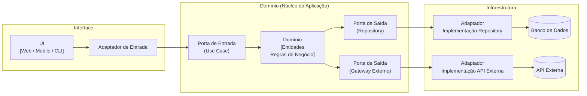

Conhecido também como arquitetura de *ports e adapters*, tende a isolar ainda mais o domínio do que a arquitetura em camadas.

Na arquitetura hexagonal, o domínio vira ainda mais o coração do software.

![[Pasted image 20260224211603.png]]

Como podemos ver, portas e adaptadores se conectam ao domínio (no caso citado como application na imagem) para realizar as operações.

As portas vão definir como o domínio será acessado. São interfaces que determinam como a ação vai ser feita em cima do domínio. Existem 2 tipos:

- Primária, ou de entrada
- Secundária ou de saída

As portas permitem especificar como o domínio será acessado por agentes externos (API UI, Console, etc). As de interface são as de entrada do domínio enquanto as de infra são as de saída. Na arquitetura hexagonal, as da esquerda fixam a interface enquanto as da direita fixam a estrutura.

Os adaptadores serão a implementação concreta das portas. Os adaptadores primários são de interface, enquanto que os secundários são de infraestrutura.

Esses dois conceitos são partes importantes do design. Dessa forma, temos o isolamento total do domínio, onde toda a regra de negócio fica isolada do sistema.

Ajuda, assim como a arquitetura em camadas, a manter a testabilidade e reúso. Essa arquitetura também é muito flexível, dado que a troca de uma tecnologia por outra diz respeito somente à troca de um adaptador ao invés do sistema inteiro. O sistema consegue evoluir de forma modular.

Essa é uma arquitetura muito interessante de se usar em projetos de grande porte. Para projetos menores, já não é uma coisa muito interessante, dado a complexidade.