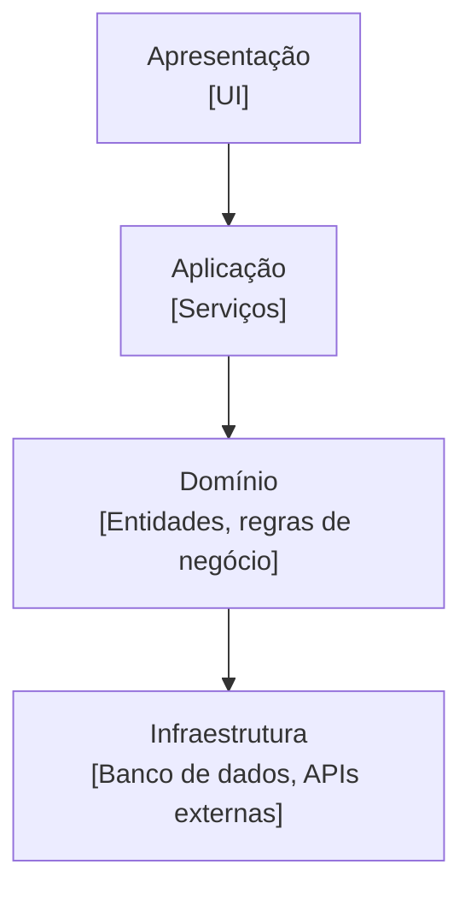

Utilizada a décadas, é uma das mais populares e clássicas. No próprio livro do DDD é utilizado a arquitetura em camadas.

Apesar de surgirem outras arquiteturas, ainda continua sendo a mais popular.

Se apresenta em algumas camadas:

Nesse cenário, podemos ver que o domínio interage com a Aplicação e a Infraestrutura, sendo isolado da apresentação.

Cada camada possui apenas 1 única responsabilidade:

- **Apresentação**: Responsável pela interface ou meio de acesso. Pode ser o Front, o terminal, etc. Apenas coleta os dados e os envia para a camada de aplicação. Vale ressaltar que usuário pode ser qualquer entidade que interaja com o sistema (uma pessoa, um agente, outra app, etc).
- **Aplicação**: Orquestra as operações do sistema, realizando validações, executando regras de negócio da camada de domínio, etc. Depende da camada de domínio para executar corretamente seu papel.
- **Domínio**: Entidades, regras de negócio e lógica central do programa. Independe de detalhes técnicos, seu foco único no negócio. Não depende de API's de terceiros, etc. Um grande exemplo seria: um paciente não pode agendar 2 consultas no mesmo horário nem ser atendido por 2 médicos ao mesmo tempo.
- **Infraestrutura**: Lida com detalhes técnicos. Interage com o banco de dados, api's externas (serviços de pagamento por exemplo), entre outras coisas.

Vale notar que o isolamento de domínio acaba sendo parcial e não total. As coisas são repassadas da aplicação para o domínio, que por sua vez conversa com a infraestrutura. Ainda assim, pode ser considerado um grande benefício. Ele fica centralizado e protegido de mudanças externas. 

Temos também clareza, testabilidade, escalabilidade e reúso. É uma ótima escolha para projetos de pequeno e médio porte mas pode se tornar difícil de manter em projetos maiores. Há um parêntesis nesse ponto entretanto. A dificuldade de manutenção de um sistema sempre diz mais sobre a capacidade técnica do time que o constrói do que da arquitetura usada.

Exemplos de arquiteturas em camadas é o próprio MVC.