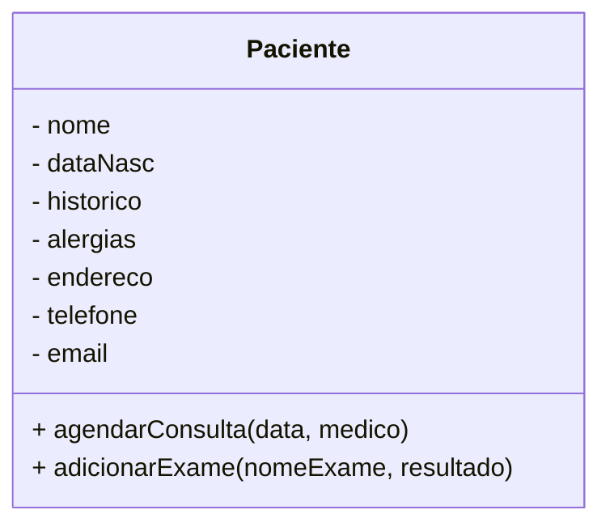

Abordagem de desenvolvimento que surgiu por meio do Eric Evans. Produziu um livro importante chamado *Tackling Complexity in the Heart of Software*

![[Screenshot 2026-02-24 at 20.36.49.png]]

O DDD busca alinhar as necessidades reais do negócio ao software. Dessa forma, conseguimos colocar pessoas que sejam especializadas no domínio, que vão representar o domínio de interesse em uma linguagem unificada entre todas as áreas.

Como cada sistema tem uma expertise necessária, é necessário unificar essa comunicação difusa. Essa unificação é feita através de algo chamado **Linguagem Ubíqua**, ou seja, uma linguagem universal usada para se comunicar da melhor forma entre os 2 grupos.

Esse tipo de arquitetura é uma proposta para alinhamento de negócios, dado que queremos resolver o problema do cliente.

## Desafios do DDD

Nem tudo são flores e o DDD traz alguns desafios importantes. Um deles é a inversão da pirâmide de tempo. Isso significa que iremos gastar muito tempo conversando para estabelecer essa linguagem ubíqua, sendo impraticável em projetos pequenos devido às estimativas.

Existe sempre uma ponderação se o DDD será o que fará o sistema ser melhor ou não.

### Comunicação Eficiente

Um dos principais pilares desse tipo de arquitetura. A comunicação eficiente surge do meio termo entre a linguagem de domínio e a linguagem de desenvolvimento.

Podemos perguntar quais informações são relevantes para uma determinada operação (cadastro, etc). A partir dessa primeira pergunta, poderemos ter respostas complementares, onde podemos trabalhar em cima desse registro. Com isso podemos estabelecer uma linguagem para tratar o sistema.

Após isso, já temos uma entidade base para o sistema:

### Domínio

É o coração do software. O núcleo do sistema onde estão as regras de negócio e a lógica central da aplicação. O que de fato soluciona o problema do cliente.

No nosso sistema exemplo acima, podemos aferir que o domínio é de um sistema hospitalar, portanto todas as regras irão girar em torno desse contexto.

#### Orientação a Objetos

Apesar de podermos alcançar o DDD em qualquer tipo de solução, a OOP fornece o arcabouço para modelar o domínio (que são as classes e objetos). Muito aliada ao DDD, provê o encapsulamento e a abstração e permite representação do domínio por meio de **entidades, objetos de valor, agregados e serviços**.

Além disso, o domínio deve estar protegido a coisas que não são relevantes a ele. Para isso, temos que **isolar o domínio**, focando nas regras de negócio. Dessa forma, podemos manter o foco na solução, melhorar a manutenabilidade e promover o reuso de código. A OOP ajuda nesse quesito também.

#### Arquitetura de Software

Vai garantir a estrutura organizacional do sistema, gerenciando a interação entre os componentes e recursos. Também ajuda no isolamento do domínio, de forma estrutural. Temos o isolamento a nível, de interface, aplicativo, domínio e infraestrutura.
