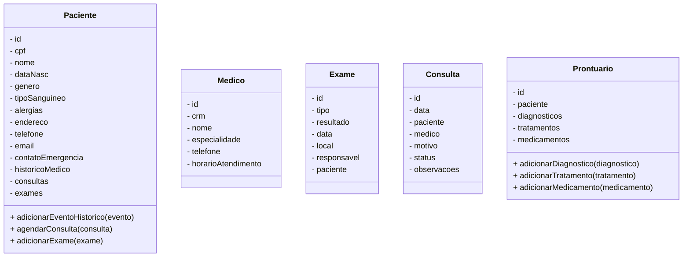
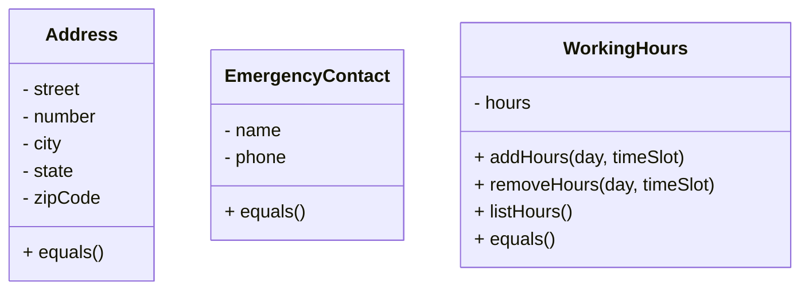
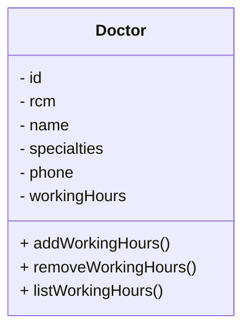

## Entidades

Objetos dentro do sistema que possuem identidades únicas. Em geral, possuem um ID único associado a objetos.

Duas entidades são diferentes, mesmo que possuam os mesmos atributos.

Também possuem ciclo de vida. As entidades podem ser criadas, modificadas ou destruídas.

Por fim, possuem comportamento, ou seja, métodos que refletem as regras de negócio: agendar consulta e proibir 2 consultas no mesmo horário por exemplo.

### Como identificar

Para identificar entidades, precisamos entender profundamente o domínio, buscando características únicas entre os pedaços do domínio e ciclos de vida. Temos alguma regra de LGPD que atuam sobre essa entidade? Ela pode nascer e morrer?

Por fim, queremos definir comportamentos também. Um conjunto de regras de negócio associados à aquela entidade como agendar consulta, agendar exame, etc.

#### Possíveis entidades

Para um exemplo de sistema hospitalar, temos os possíveis casos de entidades:

- Paciente
- Médico
- Consulta
- Exame
- Prontuário

Cada uma delas possui um ciclo de vida e características:

##### Modelagem

Uma das regras pode ser que alguns campos do paciente não precisam ser obrigatórios em casos emergenciais. Outro é que o gênero determina diagnósticos. Tipo sanguíneo também influencia. Esses tipos de regras ajudam a bater o martelo de que o paciente é uma entidade.

## Objetos de valor

Importantes para o sistema, mas dificilmente se atribui um ID. Pode ser por exemplo um endereço. Ou até mesmo informações de contato em geral (redes sociais, telefones, etc).

Dois objetos de valor podem ser iguais se todos os seus atributos forem iguais. Outra característica importante é que são imutáveis.

### Como identificar

Para identificar objetos de valor, podemos buscar elementos que não possuem identidade, e analisar os atributos. Também podemos verificar a imutabilidade dos mesmos.

#### Possíveis entidades

Recorrendo ao mesmo exemplo supracitado, temos:

- Endereço
- Contato de emergência
- Horário de atendimento
##### Modelagem

Um ponto importante é de que o WorkingHours pode alterar. Dessa forma, sempre que adicionarmos/removermos horas, temos que re-escrever a lista inteira, para garantir a imutabilidade. O médico vai acabar sofrendo algumas alterações também para comportar o diagrama:

## Agregados

Blocos de código ou entidades que relacionam objetos de valor com entidades, como por exemplo paciente e histórico de consulta.

## Serviços de domínio

Determinam operações que não pertencem à entidade _per se_. Lidamos com a entidade quando lidamos com um verbo/ação relacionado à entidade.

## Repositórios

Responsáveis por persistir/recuperar as entidades