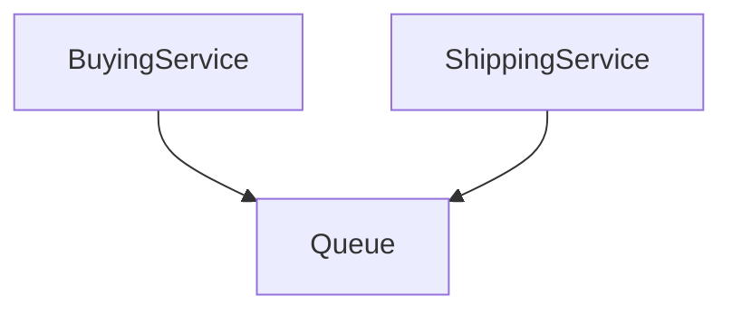

A type of communication that relies on a trigger for it to properly work. This trigger can be an UI event listener, message, websocket, anything. They can be async or not.

## Application -> Queue -> Application

In this scenario, the BuyingService sends a message to a [[Queue]], and the ShippingService is listening to this same Queue, so it gets notified every new message.

The 2 ends are not directly connected, that's why it is asynchronous.

