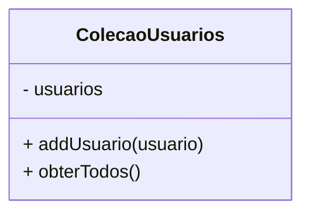
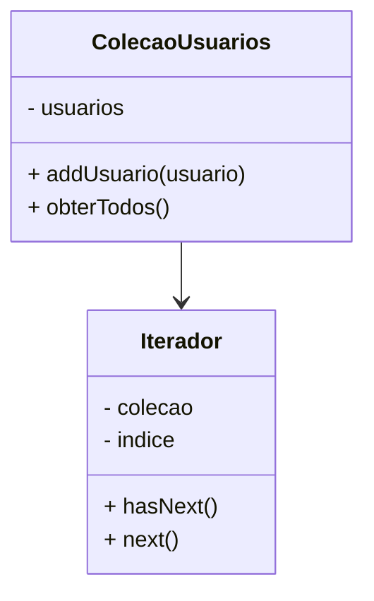

Um padrão com escopo em objetos, no comportamento dos objetos. Através do padrão iterate, podemos percorrer elementos em uma coleção de dados ou em uma estrutura de dados sem expor a estrutura interna da implementação e funcionamento da estrutura.

A lógica de navegação da estrutura é desacoplada para reutilizar a coleção com diferentes métodos de iteração ou para que estruturas muito complexas possam ser percorridas de uma forma mais simples.

Ex: um guia turístico pode ser usado para percorrer a cidade ou até mesmo um mapa. Também é possível usar um celular para navegar pelo maps. Cada método de navegação atua como um iterator, dado que permite a exploração de pontos turísticos diferentes (uma coleção de pontos), de diferentes formas.

### Exemplo prático
#### Problema

Em uma coleção de usuários, queremos adicionar um usuário a lista e percorrer essa lista de itens para trazer um elemento específico:



```js
class ColecaoUsuarios {
  constructor() {
    this.usuarios = [];
  }

  adicionarUsuario(usuario) {
    this.usuarios.push(usuario);
  }

  obterTodos() {
    return this.usuarios;
  }
}

const usuarios = new ColecaoUsuarios();
usuarios.adicionarUsuario("João");
usuarios.adicionarUsuario("Maria");
usuarios.adicionarUsuario("Pedro");

const lista = usuarios.obterTodos();

for (const usuario of lista) {
  console.log(usuario);
}
```

O problema essencialmente dessa implementação é que agora o cliente é responsável por percorrer a lista dos elementos.

Ainda que quiséssemos mover a impressão da lista para dentro da implementação da coleção, se tivéssemos que fazer uma busca invertida ou específica por exemplo, teríamos que re-implementar o método de obterTodos, não sendo efetivo de forma nenhuma.

#### Resolvendo o problema



Podemos separar os conceitos e montar uma classe de iterador. Além disso, a classe de coleção de usuários vai de fato retornar o iterador:

```js
const Iterator = require("./Iterator");

class ColecaoUsuarios {
  constructor() {
    this.usuarios = [];
  }

  adicionarUsuario(usuario) {
    this.usuarios.push(usuario);
  }

  obterTodos() {
    for (const usuario of lista) {
      console.log(usuario);
    }

    return this.usuarios;
  }

  criarIterator() {
    return new Iterator(this.usuarios);
  }
}

module.exports = ColecaoUsuarios;
```

```js
class Iterator {
  constructor(colecao) {
    this.colecao = colecao;
    this.index = 0;
  }

  next() {
    const item = this.colecao[this.index];
    this.index++;
    return item;
  }

  hasNext() {
    return this.index < this.colecao.length;
  }
}

module.exports = Iterator;
```

```js
const ColecaoUsuarios = require("./ColecaoUsuarios");

const usuarios = new ColecaoUsuarios();
usuarios.adicionarUsuario("João");
usuarios.adicionarUsuario("Maria");
usuarios.adicionarUsuario("Pedro");

const iterator = usuarios.criarIterator();

while (iterator.hasNext()) {
  console.log(iterator.next());
}
```

A primeira mudança é que agora estamos interagindo com o iterator. Todas as implementações do iterador ficam disponíveis a partir do momento em que são criadas na classe, sem necessidade de expor a lógica da collection.

Além disso, outra grande vantagem é a possibilidade de reutilizar esse iterador para literalmente qualquer collection criada posteriormente.