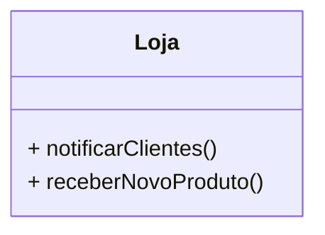
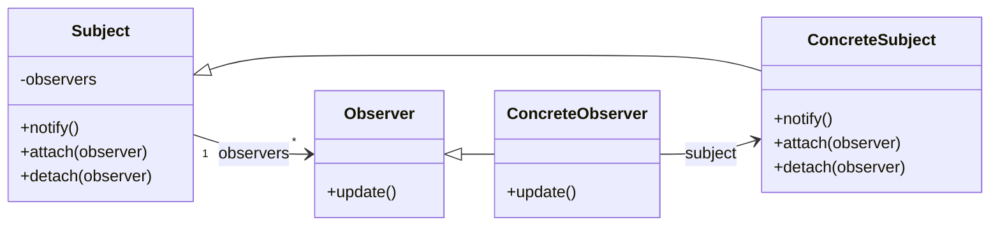
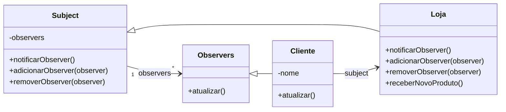

Esse padrão possui o escopo voltado a objeto e trabalha com o preceito de notificações via eventos, onde os atores (observadores) estão atentos aos pedidos para serem chamados. Usado quando uma mudança em um objeto exige mudança em vários outros.

Usando uma analogia, temos uma loja. Essa loja tem uma série de clientes com interesse de um produto onde eles desejam ser notificados assim que o produto esteja nas prateleiras. O padrão **Observer** consegue lidar com esse tipo de problema.



```js
class Loja {
  constructor() {
    this.produtoDisponivel = false;
  }

  notificarClientes() {
    if (this.produtoDisponivel) {
      console.log("Notificando clientes sobre o produto disponível");
      console.log("Cliente A notificado");
      console.log("Cliente B notificado");
      console.log("Cliente C notificado");
    }
  }

  receberNovoProduto() {
    console.log("O produto chegou à loja");
    this.produtoDisponivel = true;
    this.notificarClientes();
  }
}

const loja = new Loja();
loja.receberNovoProduto();
```

Ja temos uma série de problemas: o sistema de notificação está muito amarrado à classe, sendo que o padrão resolve um problema de acoplamento.

#### Resolvendo o problema



No caso de notificação da loja:




Importante lembrar que o update deve ser responsável por gerenciar erros. Para reestruturar o projeto, vamos definir algumas classes novas. O código estará disponível no git: [Observer](https://github.com/RunageINC/Studies/tree/main/RocketSeat/FTR-PosTech/13-DesignPatterns/Observer)

Notify não deve ter await, dado que sua responsabilidade é só de notificar.


[https://refactoring.guru/design-patterns/observer](https://refactoring.guru/design-patterns/observer)
