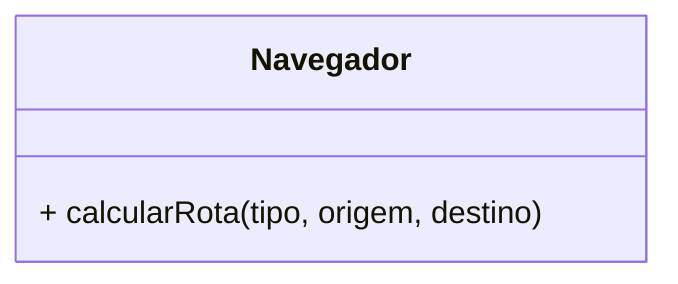
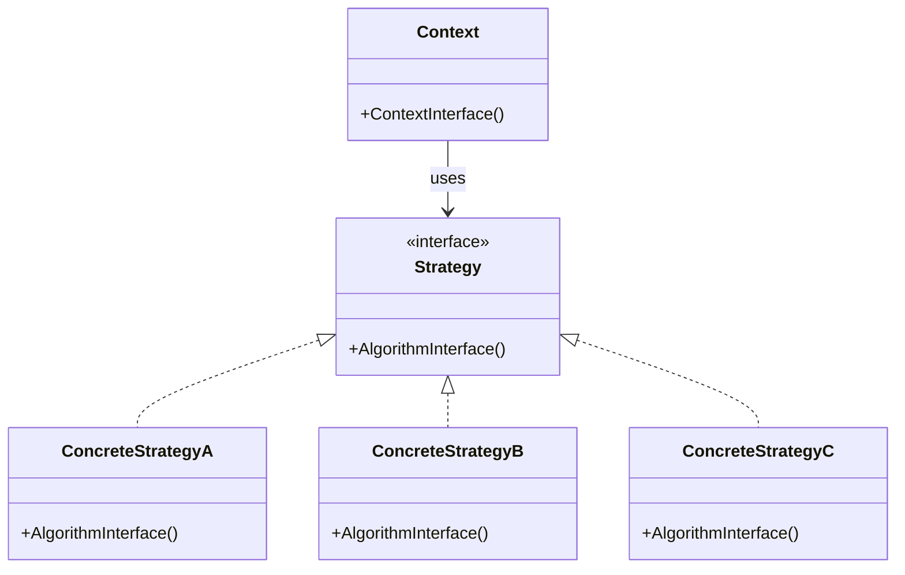
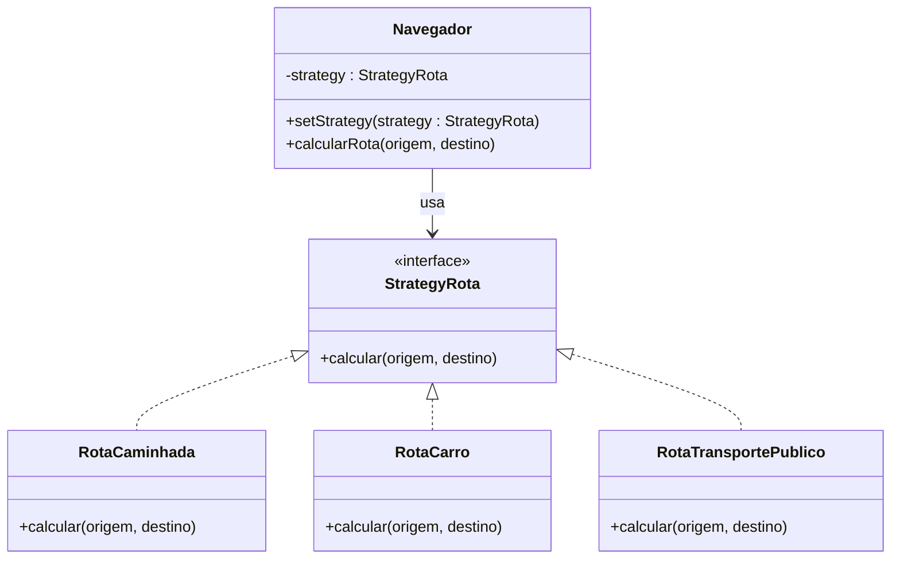

Padrão comportamental para lidar com diversas estratégias de lógica através de interfaces. Essa decisão é feita em tempo de execução e permite uma flexibilidade no código bem como facilita a manutenção e extensão. O escopo desse padrão é de objetos, e é utilizado para reaproveitar o funcionamento de classes com comportamentos diferentes mas similares entre si.

Se temos um cenário com múltiplas variações de um algorítmo que deve ser escolhido através de uma necessidade, evitando a proliferação de *if's*, *switches*, dentro da lógica principal, podemos utilizar o Strategy.

É importante ressaltar que ainda que estejamos evitando essa proliferação, é muito comum, mas não obrigatório, que haja uma decisão por detrás de qual estratégia usar com a condição cedida dentro desse pattern.

Podemos usar meios de transporte para chegar de um ponto a outro. Parece muito com o Factory Method, mas não estamos querendo criar classes novas e sim definir comportamentos. Inclusive esses dois padrões geralmente trabalham muito bem juntos. Um outro exemplo de diferenciação pode ser por meio de pagamentos. Podemos ter um Factory que cria diferentes meios de pagamento (Crédito, Débito, etc) e um Strategy de desconto que aplica descontos aos cálculos de pagamento em determinadas datas comemorativas.

### Exemplo prático
#### Problema

Supondo que queremos calcular uma rota para navegar



```js
class Navegador {
  calcularRota(tipo, origem, destino) {
    if (tipo === "carro") {
      console.log(`Calculando rota de carro de ${origem} para ${destino}`);
    } else if (tipo === "bicicleta") {
      console.log(`Calculando rota de bicicleta de ${origem} para ${destino}`);
    } else if (tipo === "onibus") {
      console.log(`Calculando rota de ônibus de ${origem} para ${destino}`);
    } else {
      console.log("Tipo de rota não suportado");
    }
  }
}

const navegador = new Navegador();

navegador.calcularRota("carro", "São Paulo", "Rio de Janeiro");
navegador.calcularRota("bicicleta", "São Paulo", "Rio de Janeiro");
navegador.calcularRota("onibus", "São Paulo", "Rio de Janeiro");
navegador.calcularRota("moto", "São Paulo", "Rio de Janeiro");

```

Podemos observar uma série de problemas, sendo um deles já a saturação do método de calcular rota. esse método é enorme e fere muito o princípio Open/Closed do SOLID caso queiramos adicionar novos meios de transporte. Todo o código está amarrado ao cliente e isso não é uma boa coisa.

#### Resolvendo o problema

O padrão tem uma definição clara de como deve ser montado:



No caso de navegação:



Dado o tamanho da resolução, deixei disponível no [repositório](https://github.com/RunageINC/Studies/tree/main/RocketSeat/FTR-PosTech/13-DesignPatterns/Strategy)

O único problema que pode ocorrer é que se um desenvolvedor não conhece o padrão Strategy, ele pode ficar um pouco perdido na hora de olhar o código.

---
### JavaScript

#### Problemática da conexão:

Em um dado momento, temos que salvar dados dependendo de como é o tipo de dado. Supondo que temos transações e logs. As transações deveriam ser salvas em um banco sequencial para garantir a atomicidade, enquanto que os logs vamos salvar em um banco não relacional.

```javascript
// Conexão do MongoDB
import MongoDB from "mongodb";

export default class MongoDBStrategy {
  #instance;

  constructor(connectionString) {
    const { pathname: dbName } = new URL(connectionString);
    this.connectionString = connectionString.replace(dbName, "");
    this.db = dbName.replace(/\W/, "");

    this.collection = "warriors";
  }

  async connect() {
    const client = new MongoDB.MongoClient(this.connectionString, {
      useUnifiedTopology: true,
    });

    await client.connect();

    const db = client.db(this.db).collection(this.collection);

    this.#instance = db;
  }

  async create(item) {
    return this.#instance.insertOne(item);
  }

  async read(item) {
    return this.#instance.find(item).toArray();
  }
}
// ---------------------------------------------------------------
// Conexão com o Postgres
import knex from "knex";

export default class PostgresStrategy {
  #instance;

  constructor(connectionString) {
    this.connectionString = connectionString;
    this.table = "warriors";
  }

  async connect() {
    this.#instance = knex({
      client: "pg",
      connection: this.connectionString,
    });

    //knex não tem um método para testar a conexão então retornamos uma query qualquer
    return this.#instance.raw("select 1+1 as result");
  }

  async create(item) {
    return this.#instance.insert(item).into(this.table);
  }

  async read(item) {
    return this.#instance.select("*").from(this.table);
  }
}
```

Nesse momento, temos 2 estratégias e para o cliente final isso tem de ser invisível sobre qual utilizar. Para esconder esses detalhes de implementação em tempo de execução, vamos utilizar uma interface que receberá qual tipo de conexão estamos tratando e então executar os métodos:

```javascript
export default class ContextStrategy {
  constructor(dbStrategy) {
    this.dbStrategy = dbStrategy;
  }

  async connect() {
    return this.dbStrategy.connect();
  }

  async create(item) {
    return this.dbStrategy.create(item);
  }

  async read(item) {
    return this.dbStrategy.read(item);
  }
}
```

Na hora de chamar os métodos:

```javascript
import ContextStrategy from "./src/base/contextStrategy.js";
import MongoDBStrategy from "./src/strategies/mongoDBStrategy.js";
import PostgresStrategy from "./src/strategies/postgresStrategy.js";
import { LOG, TRANSACTION } from "./constants.js";

import {
  POSTGRES_CONNECTION_STRING,
  MONGODB_CONNECTION_STRING,
} from "./constants.js";

const postgresContext = new ContextStrategy(
  new PostgresStrategy(POSTGRES_CONNECTION_STRING)
);
const mongoDBContext = new ContextStrategy(
  new MongoDBStrategy(MONGODB_CONNECTION_STRING)
);

await postgresContext.connect();
await mongoDBContext.connect();

const contextTypes = {
  [LOG]: mongoDBContext,
  [TRANSACTION]: postgresContext,
};
```

Dessa forma, não precisamos saber qual é o tipo de banco e chamar diretamente ele. Com nosso map de contextTypes, podemos chamar a interface **ContextStrategy** que já foi inicializada com os bancos necessários. No final das contas, os métodos em comum serão chamados através da interface em si:

```javascript
const data = [
  {
    name: "johndoe",
    type: TRANSACTION,
  },
  {
    name: "janedoe",
    type: LOG,
  },
];

for (const { type, name } of data) {
  const context = contextTypes[type];

  await context.create({ name: name + Date.now() });

  console.log(type, context.dbStrategy.constructor.name); // só para checar qual vai ser chamado
  console.log(await context.read());
}
```

Para cada dado salvo, temos um tipo. Esse tipo vai definir qual estratégia de conexão será utilizada. Então, independente da conexão estamos salvando o dado com a estratégia predeterminada, decidida através do nosso map.

### vs Factory