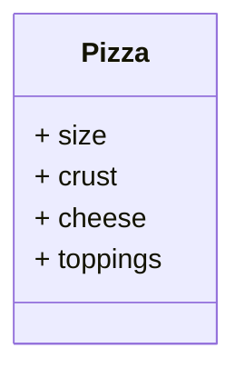
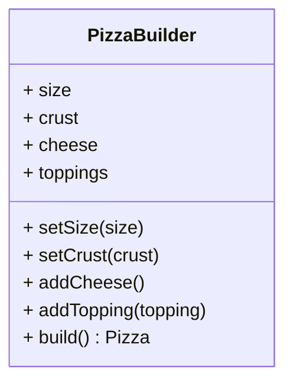
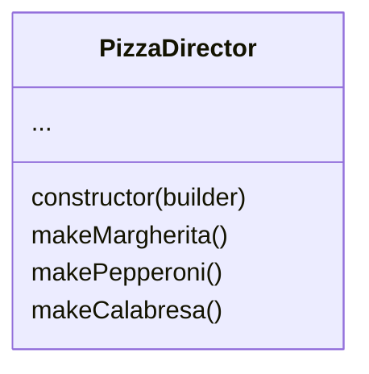
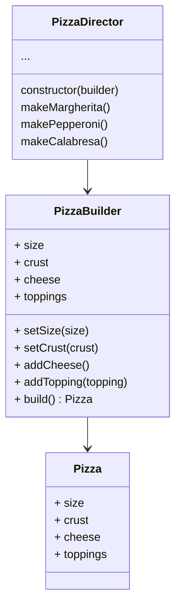

Padrão criacional para criar objetos complexos de forma simples. Podemos criar objetos de forma flexível e por partes. É um dos padrões mais utilizados para web devs e separa a construção do objeto da sua representação.

### Exemplo prático
#### Problema

Dado um exemplo comum de pizza:



Ao instanciarmos uma nova pizza, ficamos amarrados com o tanto de parâmetros que precisam ser passados para criar uma nova pizza:

```js
const margherita = new Pizza("grande", "fina", true, ["tomate", "manjericão"]);
```

Quanto mais parâmetros temos nessa criação da classe, pior fica a legibilidade do construtor. Diferentes campos também podem exigir com que diferentes construtores sejam criados para a mesma classe, tendo esses construtores que fazer uma análise combinatória das possibilidades (construtores telescópicos), tornando o código cada vez mais ilegível e propenso a erros.

#### Resolvendo o problema

Para resolver esse problema, o padrão Builder cria diversas maneiras de adicionar os elementos *on demand*



Agora ao invés de instanciar a pizza através da keyword **new**, instanciaremos com o builder:

```js
const margherita = new PizzaBuilder().setSize("grande").setCrust("fina").addCheese().addTopping("tomate").addTopping("manjericão").build();
```

```js
class PizzaBuilder {
  constructor() {
    this.size = "media";
    this.crust = "tradicional";
    this.cheese = false;
    this.toppings = [];
  }

  setSize(size) {
    this.size = size;
    return this;
  }

  setCrust(crust) {
    this.crust = crust;
    return this;
  }

  setCheese() {
    this.cheese = true;
    return this;
  }
  
  setTopping(topping) {
    this.toppings.push(topping);
    return this;
  }

  setToppings(toppings) {
    this.toppings = toppings;
    return this;
  }

  build() {
    return new Pizza(this.size, this.crust, this.cheese, this.toppings);
  }
}

module.exports = PizzaBuilder;

```

Importante sempre retornar a própria instância do objeto para que o builder funcione de maneira incremental.

Por fim, o padrão builder também pode possuir um diretor, que funciona como um orquestrador para chamar esses métodos:






```js
class PizzaBuilder {
  constructor() {
    this.reset();
  }

  reset() {
    this.size = "media";
    this.crust = "tradicional";
    this.cheese = false;
    this.toppings = [];
  }

  setSize(size) {
    this.size = size;
    return this;
  }

  setCrust(crust) {
    this.crust = crust;
    return this;
  }

  setCheese() {
    this.cheese = true;
    return this;
  }

  setTopping(topping) {
    this.toppings.push(topping);
    return this;
  }

  setToppings(toppings) {
    this.toppings = toppings;
    return this;
  }

  build() {
    const pizza = Pizza(this.size, this.crust, this.cheese, this.toppings);
    this.reset();

    return pizza;
  }
}

module.exports = PizzaBuilder;

/* ---------------------------------------- */

class PizzaDirector {
  constructor(builder) {
    this.builder = builder;
  }

  buildMargherita() {
    return this.builder
      .setSize("grande")
      .setCrust("tradicional")
      .setCheese()
      .setTopping("tomate")
      .setTopping("cebola")
      .setTopping("azeitona");
  }

  buildPepperoni() {
    return this.builder
      .setSize("grande")
      .setCrust("tradicional")
      .setCheese()
      .setTopping("tomate")
      .setTopping("cebola")
      .setTopping("azeitona")
      .setTopping("pepperoni");
  }
}

module.exports = PizzaDirector;
```

Então podemos usar o Director para orquestrar a criação de objetos pré determinados, reduzindo ainda mais o código:

```js
const PizzaBuilder = require("./PizzaBuilder");
const PizzaDirector = require("./PizzaDirector");

const builder = new PizzaBuilder();
const director = new PizzaDirector(builder);

const margherita = director.buildMargherita();
const pepperoni = director.buildPepperoni();

console.log(margherita);
console.log(pepperoni);
```

---

Faz parte do padrão de Fluent Interface ou [[Fluent API]], onde utiliza de [[Method Chaining]] em seu processo de criação de objetos.

Muitas vezes, utiliza-se o padrão [[Facade]] para sequenciar os fluxos completos em uma pipeline. Isso resolve o problema que pode tornar o Builder ou o Fluent API um _anti-pattern_, dado que sempre que se utiliza do Builder, é necessário saber a ordem dos métodos (se existe).

Não são ideais para programação funcional, dado que tratam de estados do objeto. Mas são perfeitos para POO.


[https://refactoring.guru/design-patterns/builder](https://refactoring.guru/design-patterns/builder)

[https://github.com/ErickWendel/semana-javascript-e...](https://github.com/ErickWendel/semana-javascript-expert02/blob/main/aula04/public/pages/room/src/util/peer.js)

[https://refactoring.guru/design-patterns/builder](https://refactoring.guru/design-patterns/builder)

[https://en.wikipedia.org/wiki/Fluent_interface](https://en.wikipedia.org/wiki/Fluent_interface)

[https://martinfowler.com/bliki/FluentInterface.html](https://martinfowler.com/bliki/FluentInterface.html)