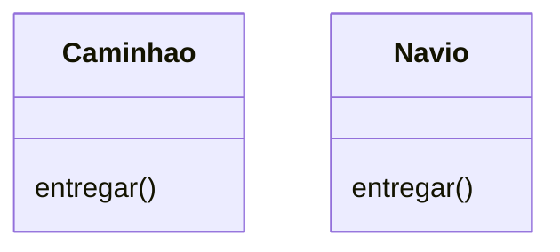
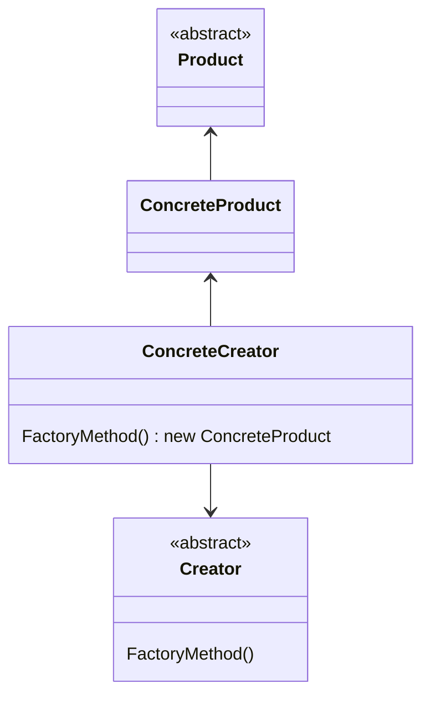
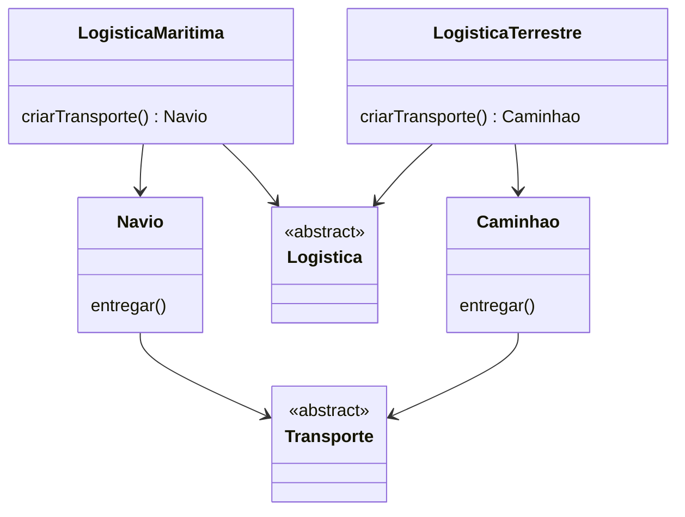

Padrão dedicado à criação de classes, possibilita a instânciação de objetos dessa classe sem expor a lógica por trás da criação. Esse pattern vai te fornecer uma interface que permite criar objetos em uma superclasse, e que as subclasses desse objeto alterem o tipo do objeto que será criado de forma dinâmica.

Por ex: temos um sistema logístico onde precisamos levar encomendas. Essa encomenda pode ser levado de carro, moto, avião, bicicleta, navio, etc. O importante é que todos sejam meios de transporte e em termos de implementação isso pouco vai importar. A única parte importante é saber se a encomenda chegou ao destino.



Nesse exemplo, internamente vão existir diversas classes que representam cada um dos meios de transporte. Com base no local de entrega por exemplo podemos determinar que a entrega será feita de navio.

Do lado do cliente, de quem vai usar a app, basta saber que existe um método de transporte para a encomenda.

É um ótimo padrão para solucionar problemas de acoplamento, sendo o principal antagonista do if/else

### Exemplo prático
#### Problema

Dado o mesmo cenário de entrega, sem factory:

```js
class Caminhao {
  entregar() {
    console.log("Entregando por caminhão");
  }
}

class Navio {
  entregar() {
    console.log("Entregando por navio");
  }
}

const tipoDeTransporte = "caminhao";

let transporte;

if (tipoDeTransporte === "caminhao") {
  transporte = new Caminhao();
} else if (tipoDeTransporte === "navio") {
  transporte = new Navio();
}

transporte.entregar();
```

Se tivéssemos N transportes, teríamos N condições em if else. Ainda que troquemos um switch, ainda teríamos uma coleção infinita de instâncias.

#### Resolvendo o problema



Utilizando o exemplo de entregas, teríamos algo mais próximo do seguinte diagrama



Todo o acoplamento vai embora e temos uma dinamicidade melhor de decisão de qual objeto será criado a partir da classe.

A grande desvantagem é o aumento de classes existentes em prol de reduzir o acoplamento de produtos concretos.

Sempre que houver uma hierarquia de objetos que compartilham uma interface faz sentido usar o Factory Method.

Dado o tamanho do código para explicar o exemplo, ele estará disponível no git: [Factory Method](https://github.com/RunageINC/Studies/tree/main/RocketSeat/FTR-PosTech/13-DesignPatterns/FactoryMethod)

---
Pode ser usado tanto para programação funcional quanto para POO

Muito comum para esse padrão é o Connection Factories, que trata conexões com bancos, mantendo a assinatura. 

Quando estamos falando de Connection Factories, podemos utilizar Dependency Injection para manipular os dados com maior facilidade.

### Abstract Factory

Uma extensão do Factory, utilizado para criar interfaces dinâmicas. Nos permite criar famílias de objetos relacionados sem especificar as classes concretas.