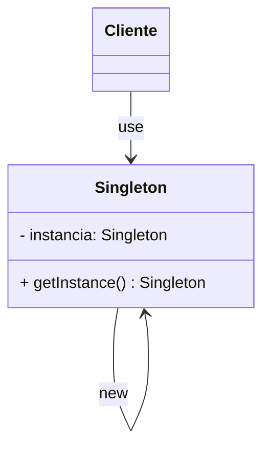

Padrão criacional que garante que uma classe tenha apenas uma única instância. Essa instância age de forma global e também possui um ponto único de acesso. 




Muito usado em frameworks como o Spring por exemplo, que trata os Beans como singletons. Usado também em conexões com bancos de dados. Para alguns outros programas também é muito plausível como por exemplo em um sistema de gerenciamento de telas do windows, ou sistemas de logs.

### Exemplo prático
#### Problema

Supondo que temos um sistema de logs:

```js
class Logger {
  constructor() {
    this.logs = [];
  }

  log(message) {
    this.logs.push(message);
    console.log(`Mensagem: ${message}`);
  }

  print() {
    console.log(this.logs.length);
  }
}

module.exports = Logger;
```

Poderíamos usar ele da seguinte forma:

```js
const Logger = require("./Logger");

const logger1 = new Logger();
const logger2 = new Logger();
const logger3 = new Logger();
```

E ai já temos um problema. Podemos ter N instâncias de log, e coisas do seguinte tipo podem acontecer: 

```js
logger1.log("Primeira mensagem");
logger2.log("Segunda mensagem");

logger1.print();
logger2.print();
```

Dessa forma, os dois loggers estariam com o mesmo tamanho. Pensando em um sistema grande, esse problema poderia estar espalhado em diversos locais, tendo vários logs diferentes.

#### Resolvendo o problema

```js
class SingletonLogger {
  constructor() {
    if (SingletonLogger.instance) {
      return SingletonLogger.instance;
    }

    SingletonLogger.instance = this;
    this.logs = [];
  }

  log(message) {
    this.logs.push(message);
    console.log(`Mensagem: ${message}`);
  }

  print() {
    console.log(this.logs.length);
  }
}

module.exports = SingletonLogger;

```

Validando se a instância já existe, podemos retorná-la e nosso código anterior atualizará para todos os objetos em questão.


| Vantagens                                                                                                               | Desvantagens                                                                                                                                                              |
| ----------------------------------------------------------------------------------------------------------------------- | ------------------------------------------------------------------------------------------------------------------------------------------------------------------------- |
| Um objeto apenas criado para gerenciar recursos compartilhados                                                          | Viola o princípio de Single Responsibility: gere a si e gerencia o processo de instanciação                                                                               |
| Ponto único de acesso sem possibilidade de sobrescrita acidental como nas variáveis globais                             | Em ambientes multithread, há um trabalho adicional para garantir apenas uma instância do objeto e não uma por thread                                                      |
| Lazy-loading, criando a instância só quando necessário. Remove um pouco do espaço que seria necessário para esse objeto | Dependendo da linguagem utilizada, testes unitários envolvendo esse padrão se tornam muito complexos ou impossíveis, se optarmos por construtores privados para a classe. |

Para alguns autores, esse pattern é considerado como **anti-pattern** dado a violação de alguns princípios.