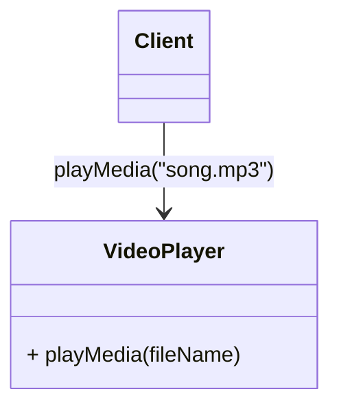
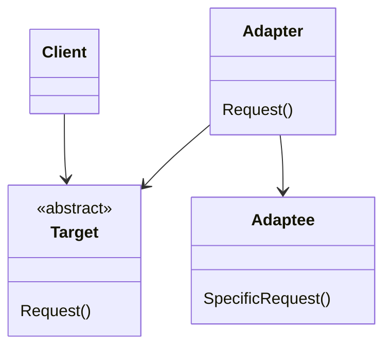
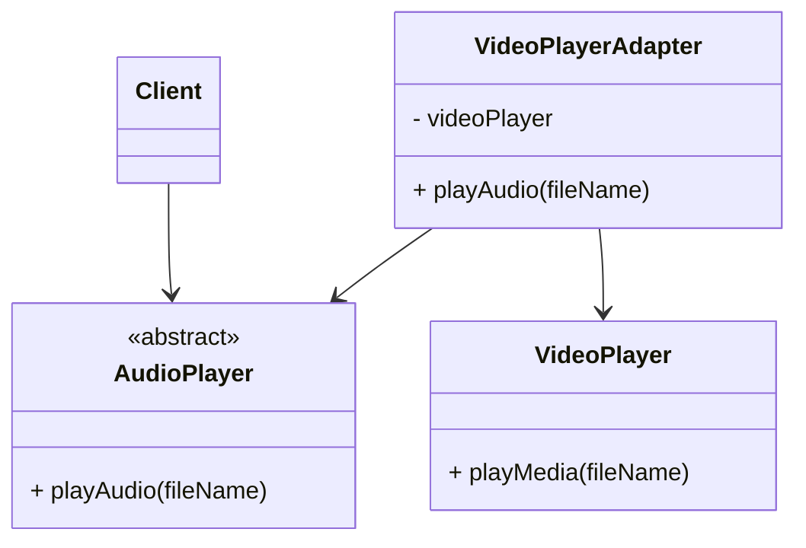

Padrão estrutural que pode ser utilizado tanto para estruturar classes quanto objetos. Recebemos uma interface para auxiliar a conectar diferentes sistemas, ou seja, fazer 2 coisas diferentes cooperarem para um objetivo em comum.

Usado no mundo real para integrar bibliotecas, tornando compatível que antes era incompatível.

Exemplos da vida real são os famosos benjamins que auxiliam na conexão de diversos tipos de tomadas.

Em termos técnicos, o diagrama ficaria da seguinte forma

Traduzindo para nosso exemplo:

O grande foco ficaria no cenário do meio, em fazer um video player reproduzir somente áudio. Outro cenário seria em conversor de XML para JSON, onde já temos o leitor e processador de JSON pronto, e agora queremos utilizar o mesmo para processar XML. Podemos usar o adapter para fazer com que essa conversão aconteça de alguma forma e depois utilizar o processador de JSON.

Dado o tamanho da implementação, ela estará disponível no [repositório](https://github.com/RunageINC/Studies/tree/main/RocketSeat/FTR-PosTech/13-DesignPatterns/Adapter)