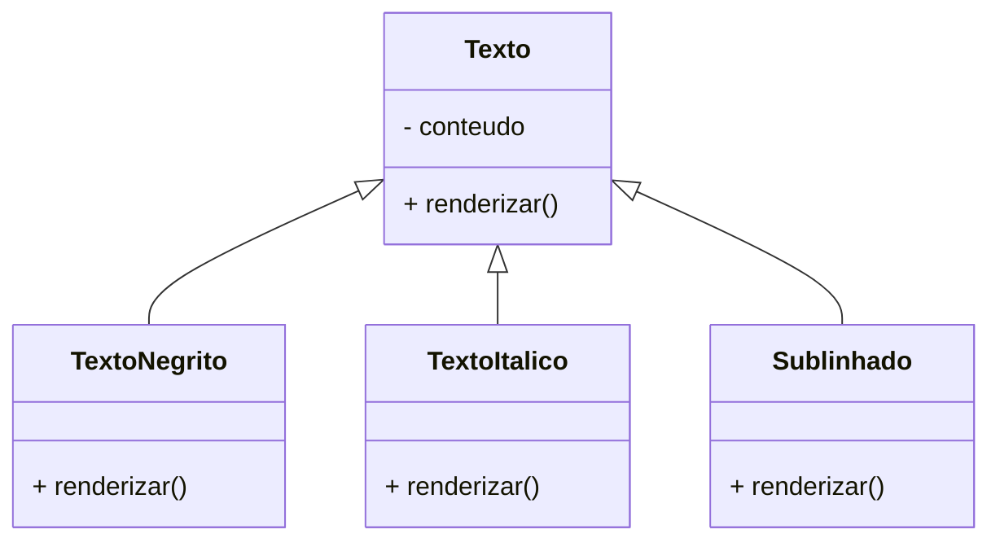
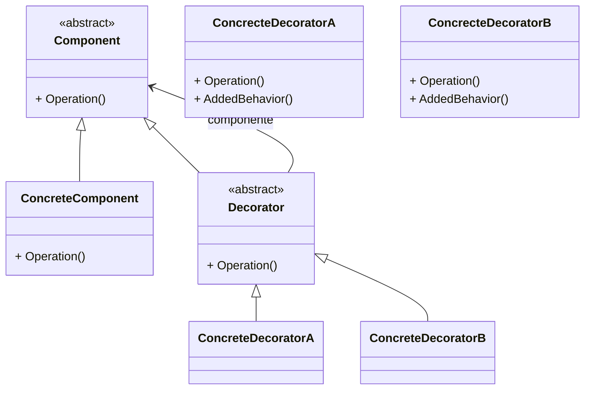
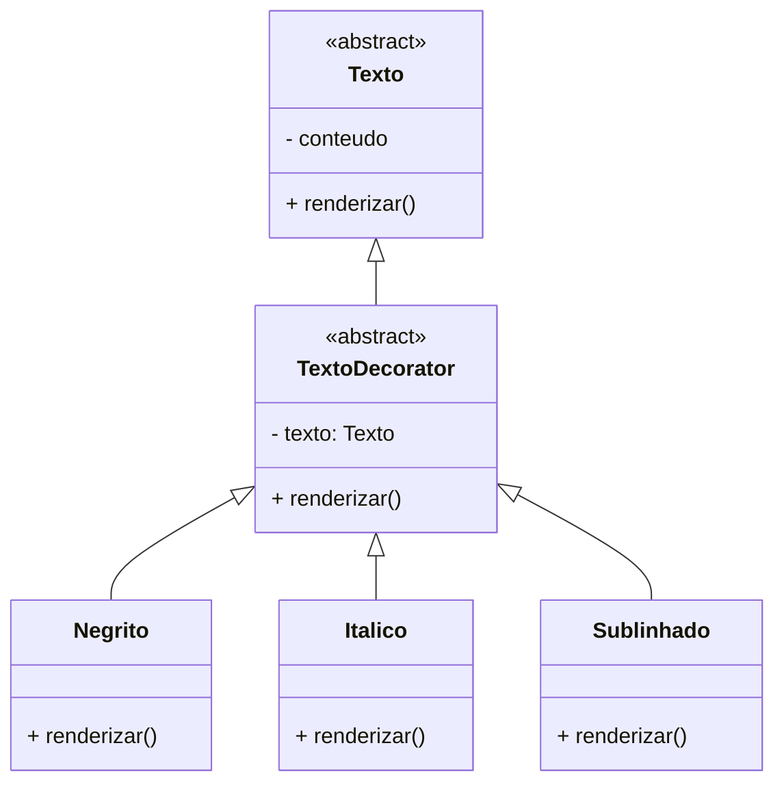

Algumas vezes queremos adicionar responsabilidades a objetos individualmente e não a toda classe que representa esse conjunto de objetos. 

Para objetivo similar, nós usamos geralmente herança, mas esse é um padrão inflexível dado que as propriedades tratadas na herança são estáticas. Para resolver isso, surge o padrão Decorator cujo escopo pertence aos objetos.

Através desse padrão, podemos adicionar novos comportamentos dinamicamente a um objeto, sem modificar a classe base. Um exemplo pode ser:



```js
class Texto {
  constructor(conteudo) {
    this.conteudo = conteudo;
  }

  renderizar() {
    return this.conteudo;
  }
}

class TextoNegrito extends Texto {
  renderizar() {
    return `<b>${super.renderizar()}</b>`;
  }
}

class TextoSublinhado extends Texto {
  renderizar() {
    return `<u>${super.renderizar()}</u>`;
  }
}

class TextoItalico extends Texto {
  renderizar() {
    return `<i>${super.renderizar()}</i>`;
  }
}
```

A proposta de implementação do Decorator é a seguinte:



Adequando a solução anterior temos:



Dado o tamanho da resolução, deixei disponível no [repositório](https://github.com/RunageINC/Studies/tree/main/RocketSeat/FTR-PosTech/13-DesignPatterns/Decorator)