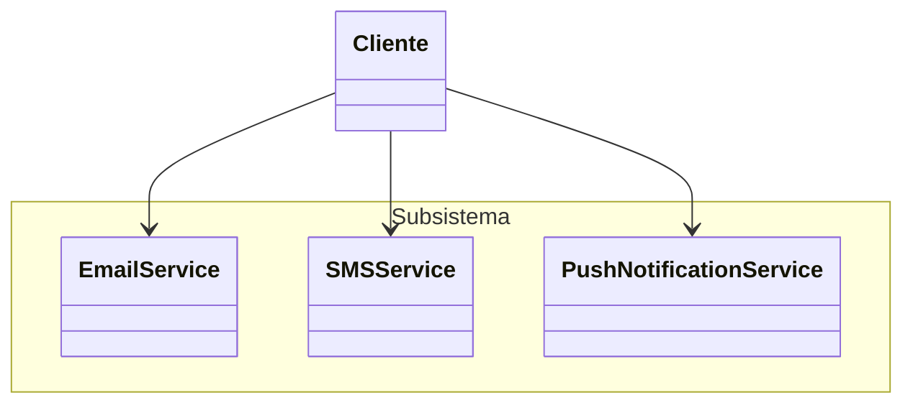
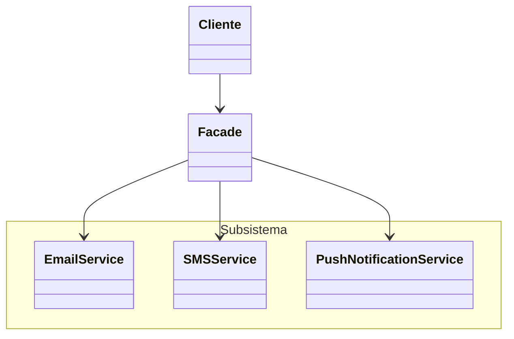

Lida com uma "fachada", um intermédio entre um sistema interno e conexão externa. É um padrão estrutural, voltado a construção de objetos. Permite com que uma interface simplificada seja fornecida para um subsistema ou sistema complexo.

Reduz o acoplamento, melhora o encapsulamento, auxilia na abstração dos detalhes internos. Quase como um garçom que busca os produtos na cozinha independente dos passos necessários dentro do sistema mais complexo como a cozinha.

![[Screenshot 2026-02-03 at 19.27.40.png]]

Um exemplo de um sistema sem façade pode ser visto da seguinte forma



Dessa forma, o consumidor do subsistema precisa se comunicar diretamente com as classes, deixando exposto as implementações:

```js
class EmailService {
  sendEmail(to, message) {
    console.log(`Enviando email para ${to}: ${message}`);
  }
}

class SMSService {
  sendSMS(to, message) {
    console.log(`Enviando SMS para ${to}: ${message}`);
  }
}

class PushNotificationService {
  sendPushNotification(to, message) {
    console.log(`Enviando push notification para ${to}: ${message}`);
  }
}

const emailService = new EmailService();
const smsService = new SMSService();
const pushNotificationService = new PushNotificationService();

emailService.sendEmail("teste@teste.com", "Hello, world!");
smsService.sendSMS("+1234567890", "Hello, world!");
pushNotificationService.sendPushNotification("+1234567890", "Hello, world!");
```

Com o padrão façade, podemos desacoplar essa dependência:



```js
class EmailService {
  sendEmail(to, message) {
    console.log(`Enviando email para ${to}: ${message}`);
  }
}

class SMSService {
  sendSMS(to, message) {
    console.log(`Enviando SMS para ${to}: ${message}`);
  }
}

class PushNotificationService {
  sendPushNotification(to, message) {
    console.log(`Enviando push notification para ${to}: ${message}`);
  }
}

class NotificationFacade {
  constructor() {
    this.emailService = new EmailService();
    this.smsService = new SMSService();
    this.pushNotificationService = new PushNotificationService();
  }

  sendNotification(type, to, message) {
    switch (type) {
      case "email":
        this.emailService.sendEmail(to, message);
        break;
      case "sms":
        this.smsService.sendSMS(to, message);
        break;
      case "push":
        this.pushNotificationService.sendPushNotification(to, message);
        break;
      default:
        console.log("Tipo de notificação desconhecido.");
    }
  }
}

const notificationFacade = new NotificationFacade();
notificationFacade.sendNotification(
  "email",
  "teste@teste.com",
  "Hello, world!"
);
notificationFacade.sendNotification("sms", "+1234567890", "Hello, world!");
notificationFacade.sendNotification("push", "+1234567890", "Hello, world!");

```