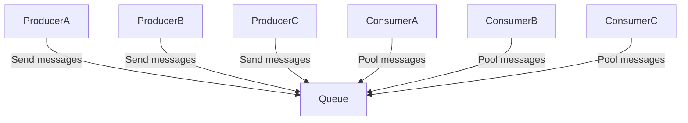

#General 

Basically, queues are one way of asynchronous communications. They can be used as a strategy for decoupling applications and maintain cross-communications among them.

Queues basically functions this way:

- **Producer**: responsible for sending messages that will be used for communication across applications.
- **Queue**: stores the message to be consumed
- **Consumer**: consumes from the queue