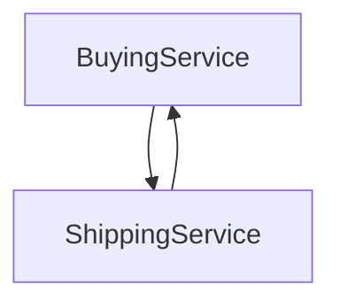

#General 

Applications are directly connected to one another, so the communication is direct between them.

For example in an e-commerce scenario:

In this scenario, the BuyingService is sending a request to the ShippingService and waits for a response before sending anything to the final user.

This type of communication can face some problems if there are sudden spikes of traffic as one app will translate this spike to the other.

One of the ways of solving this problem is to decouple the application.