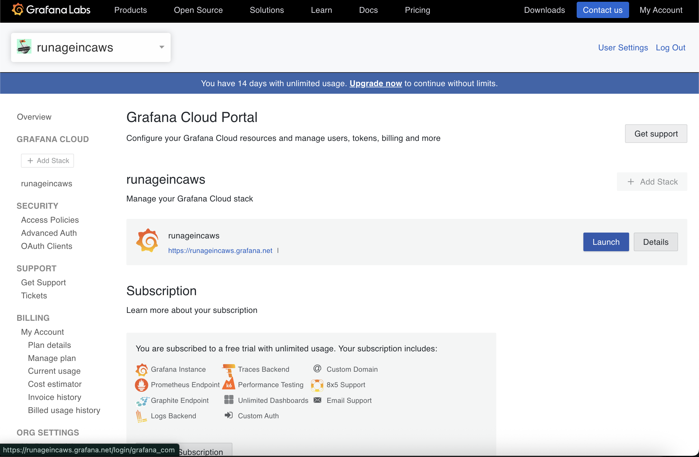
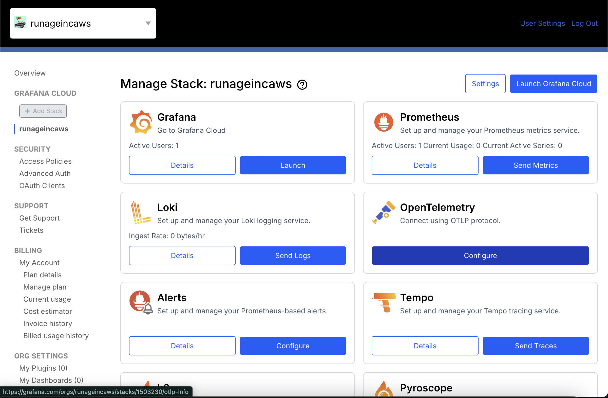
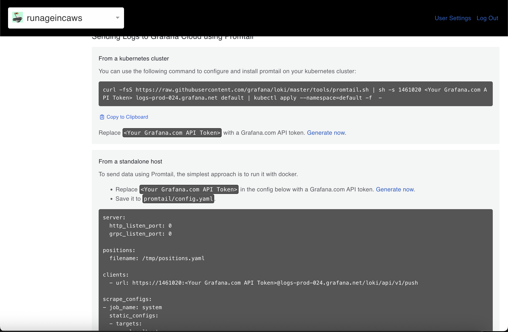
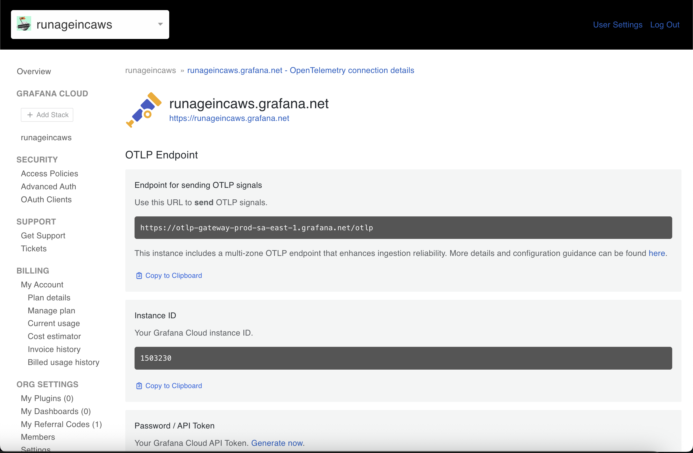
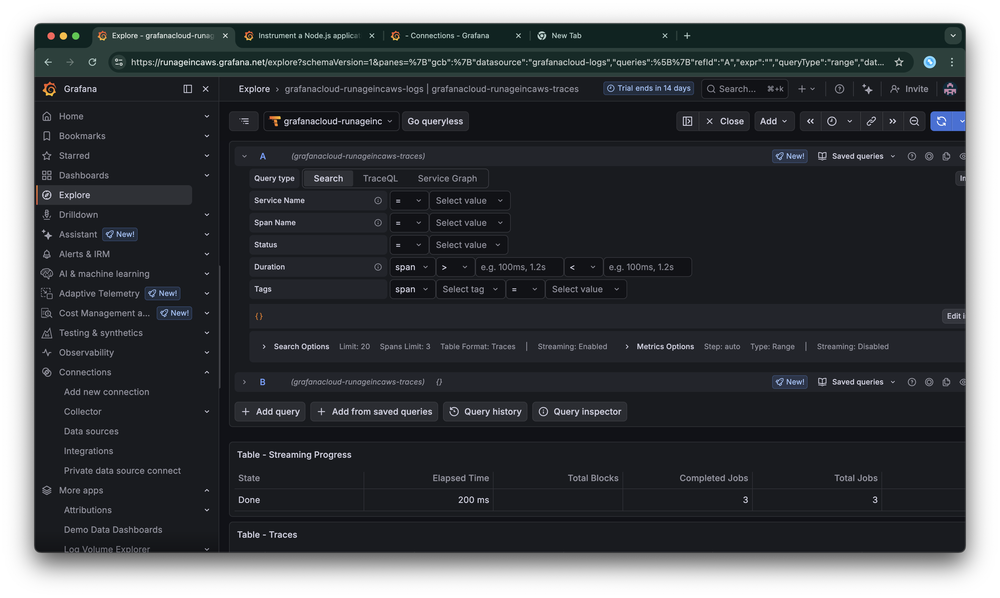
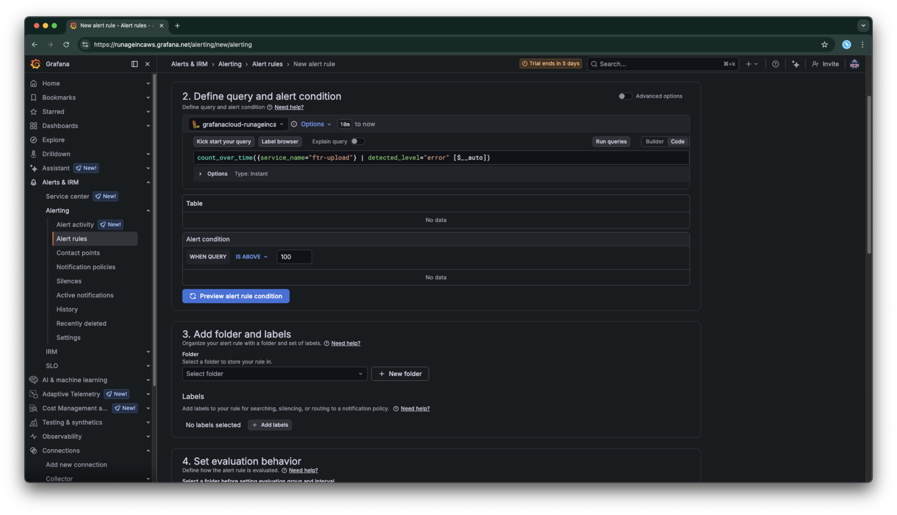
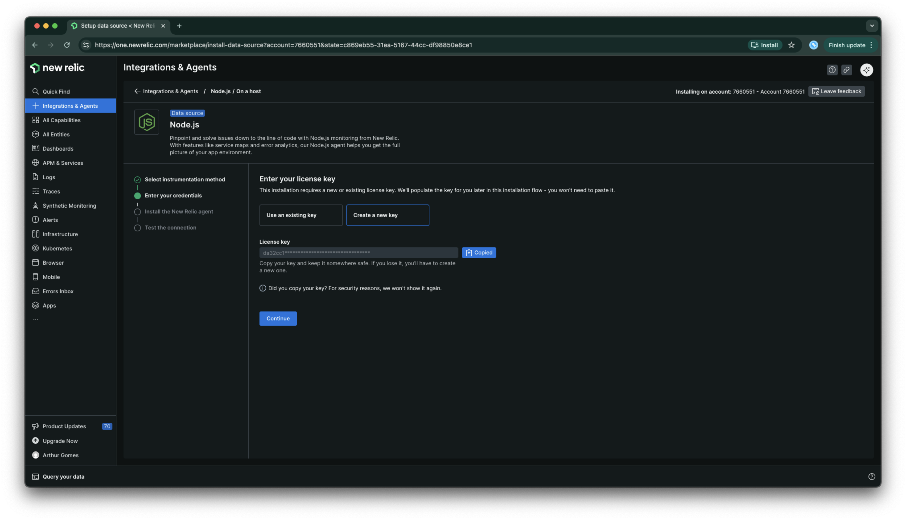
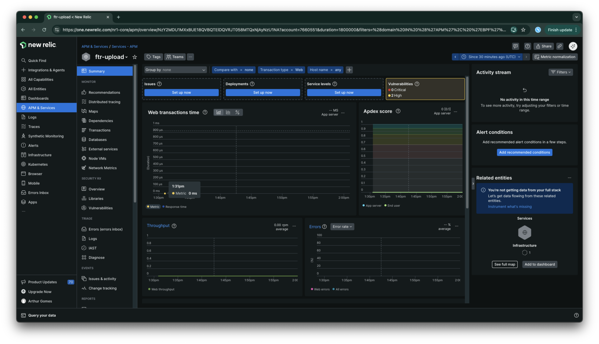

# Introdução

É necessário criar uma conta no Grafana e uma stack para o projeto.

## Grafana

Depois de criar a conta, basicamente a stack estará pronta. Agora podemos adicionar algumas configurações para fazer a telemetria. Podemos fazer o launch do dash através da stack:



O Grafana permite desacoplar responsabilidades através do uso de aplicações stateless. A app emite o log e o serviço (no caso o Grafana) faz a indexação e distribuição desses logs. Se a app cair ou o container deixar de existir, os logs não se perdem dado que foram apenas emitidos.

O Grafana tem também os conceitos de logs para cada serviço, como o LogQL (Loki Query Language) e o PromQuery (Prometheus Query), TraceQL (Tempo Query Language), etc.

Quando clicamos em **Details** na página de stack, podemos escolher uma tecnologia como o Loki para fazer o **Send Logs**:



O próprio serviço nos dá opções de como enviar os logs



Porém, mesmo que usássemos o Grafana Alloy para fazer isso o máximo agnóstico possível, teríamos problemas. Por isso não vamos usar essas configurações sugeridas e sim usar o OTel, configurando o protocolo:



Vale ressaltar que o endpoint do OTel é genérico e o que define para onde vão os logs é o token criado para a app.

## Configuração

Para o nosso caso, basta seguir a configuração do node. Temos algumas variáveis pra setar. Embora muitas sejam auto explicativas, é importante ressaltar que os exporters são justamente pra onde cada coisa vai ser enviada. Dessa forma, a aplicação não precisa conhecer os pormenores, e sim somente o Open Telemetry sendo que a configuração de pra onde irão as métricas fica no colector.

Como estamos trabalhando com a Grafana Cloud, a configuração ja é auto gerenciável.

A node options nesse caso sobe a instrumentação antes da app. Isso pode trazer problemas caso o ecossistema seja muito grande e nesses casos necessita ajuste.

O resource attributes, nos permite indicar o serviço a ser instrumentado. Caso tenhamos deploy automatizado, poderíamos colocar container ID, ID da versão, etc.

Dentro de detectors, temos env, host e os. Isso predetermina que vamos ter qual ambiente instrumentado, qual host e qual sistema operacional está executando ele.

Vale ressaltar que as variáveis `OTEL_EXPORTER_OTLP_PROTOCOL, OTEL_EXPORTER_OTLP_ENDPOINT e OTEL_EXPORTER_OTLP_HEADERS` não são da aplicação e sim do cluster, e é compartilhado por todas as apps que fazem parte daquele cluster.

## Logging

Interessante ressaltar que mesmo que a app tenha já algumas instrumentalizações ali se formos no grafanacloud na parte de traces, podemos ver algumas informações de trace e span:



Os logs não serão exibidos. Isso porque se inspecionarmos a rota de `/health`, que é a rota que estamos batendo para verificar, o único índice de log que temos é esse:

```typescript
server.listen({ port: 3333, host: "0.0.0.0" }).then(() => {
  console.log("Server is running on port 3333");
});
```

Esse console serve apenas para debug, como em muitas outras linguagens, e não para instrumentalizar de fato. Para enviar um log para o grafana, precisamos ter um formatador de logs. No caso do JS, podemos usar o pino para padronizar o log.

> Adendo: tive que fazer algumas alterações no pino para enviar os logs para o grafana. Provavelmente no momento da aula as dependências nas versões faziam sentido, mas com as atualizações não fazem mais.

## Alerta

O Grafana Cloud disponibiliza de alertas e ferramentas para On-Call. Para utilizar os alertas, temos que definir quais regras serão acionadas para cada alerta.

Existem várias formas de alertar um usuário incluindo utilizando pontos de contato diversos como email, webhook, sms, etc.

Vale ressaltar que antes de fazer alguma coisa, o log PRECISA estar estruturado, para que possamos capturar o nível do log.

Alertas só funcionam com dados numéricos, ou seja, para programar um alerta baseado em erros precisamos determinar o número de incidências:

```logql
count_over_time({service_name="ftr-upload"} | detected_level="error" [$__auto])
```

Sendo o $\_\_auto o range do tempo que ele vai usar.

Após coletarmos o número de incidências, conseguimos setar qual o threshold que esse alerta irá atingir:



Podemos adicionar labels para deixar mais fácil de pesquisar.

## New Relic

Ferramenta de monitoramento e gerenciamento de métricas através de uma app. Também se integra com o OpenTelemetry. Para esse exemplo, vamos usar o New Relic diretamente.

A integração exige uma key e a instalação do pacote. Isso pode ser feito de maneira rápida dentro da aba de integrations:



Importante ressaltar que é necessário adicionar na execução do New Relic à execução do node

```json
"dev": "NODE_OPTIONS='--require @opentelemetry/auto-instrumentations-node/register' tsx watch --env-file .env -r newrelic src/infra/http/server.ts",
"start": "node -r newrelic dist/infra/http/server.js"
```

Também é importante adicionar nos CMD's do docker

```docker
CMD ["node -r newrelic", "dist/infra/http/server.js"]
```

Caso esteja certo, é possível ver o APM:



### Configurando no container

Para configurar no container na AWS, vamos no nosso container, em Task Definition e conseguiremos adicionar em uma nova revisão as credenciais do NR.

#### Disclaimer: container

Dependendo de como foi configurado seu docker, pode não funcionar de primeira. Caso esteja usando por exemplo uma imagem da chainguard, o comando Node não será reconhecido.

Uma alternativa pra isso seria usar a imagem Alpine dado que ela aceita a inferência do node.

Outra forma seria remover do start e quebrar o cmd em parâmetros:

```docker
CMD ["-r", "newrelic", "dist/server.mjs"]
```

---

Diferente
do Grafana, o New Relic possui uma linguagem de query de logs mais próxima ao SQL, chamada NRQL

Também é possível colocar alertas no New Relic assim como no Grafana Cloud. Os princípios são os mesmos: temos que ter algo agregável e contável por número, temos que ter um threshold a ser atingido e qual a criticidade de cada coisa.

A criação de um alerta no New Relic, assim como no Grafana, é bem explicada na plataforma, sendo a parte mais complicada a definição da query de cada alerta.

Dentro do New Relic podemos agrupar alertas por policy. Essas policies que definirão como será o envio de notificação, como serão os agrupamentos de alertas similares, etc.

Também é possível dentro do alerta configurar um Runbook que é um documento que diz como resolver esse tipo de incidente.
