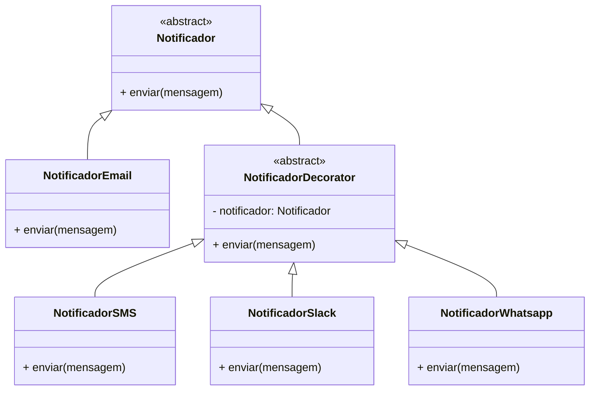

```mermaid
classDiagram
	Notificador <|-- NotificadorEmail
	Notificador <|-- NotificadorDecorator
	NotificadorDecorator <|-- NotificadorSMS
	NotificadorDecorator <|-- NotificadorSlack
	NotificadorDecorator <|-- NotificadorWhatsapp

	class Notificador {
		+ enviar(mensagem)
	}

	class NotificadorDecorator {
		- notificador: Notificador
		+ enviar(mensagem)
	}

	class NotificadorEmail {
		+ enviar(mensagem)
	}

	class NotificadorSMS {
		+ enviar(mensagem)
	}

	class NotificadorSlack {
		+ enviar(mensagem)
	}

	class NotificadorWhatsapp {
		+ enviar(mensagem)
	}

	<<abstract>> Notificador
	<<abstract>> NotificadorDecorator
```
