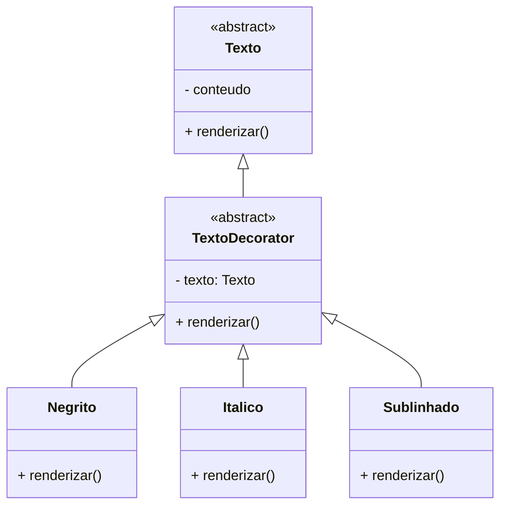

```mermaid
classDiagram
	Texto <|-- TextoDecorator
	TextoDecorator <|-- Negrito
	TextoDecorator <|-- Italico
	TextoDecorator <|-- Sublinhado

	class Texto {
		- conteudo
		+ renderizar()
	}

	class TextoDecorator {
		- texto: Texto
		+ renderizar()
	}

	class Negrito {
		+ renderizar()
	}

	class Italico {
		+ renderizar()
	}

	class Sublinhado {
		+ renderizar()
	}

	<<abstract>> Texto
	<<abstract>> TextoDecorator
```
