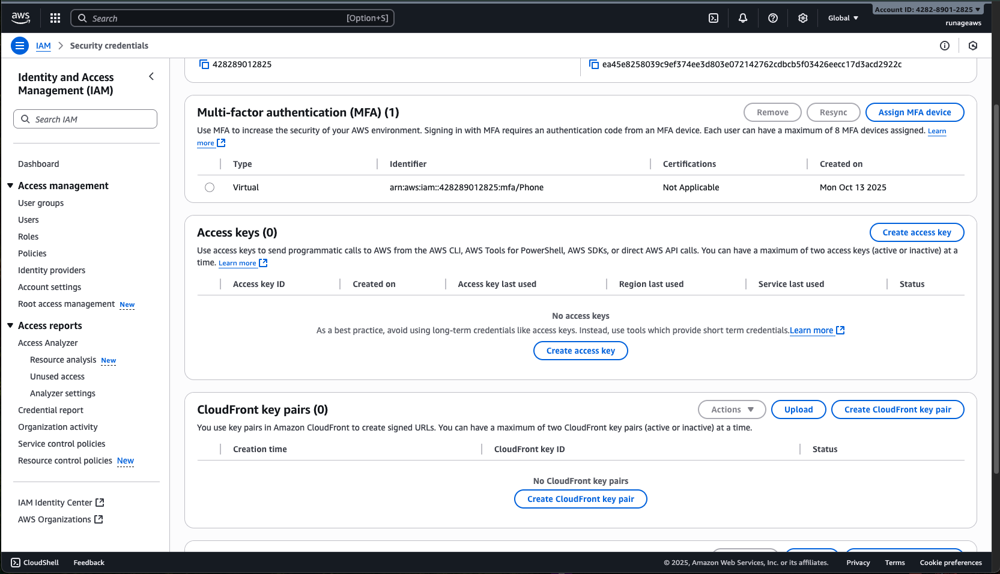
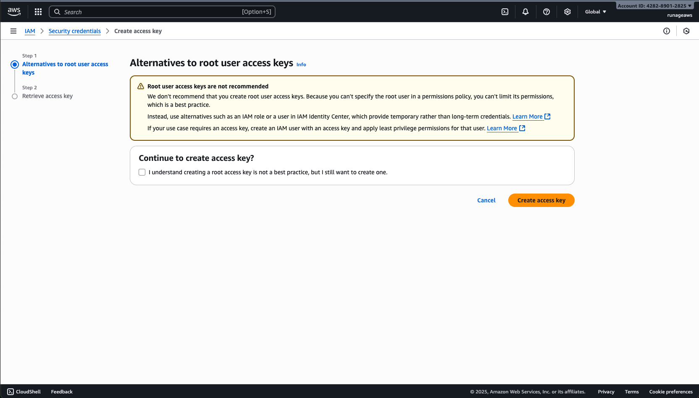

# Container Registry

Container Registry ou Image Registry é o local onde as imagens de containers ficam registradas, como uma espécie de github de imagens.

Apesar de ter essa possibilidade, a menos que seja um open source, não é uma boa prática ter esse tipo de imagem pública, dado que temos a exposição para todo o docker hub.

Para criar um repositório via CLI, devemos executar alguns comandos básicos:

- Criar uma build com o docker build
  - `docker build -t widget-server:v1 .`
    - Esse comando gera uma build taggeada com versionamento para subir no registry.
- _Em ambiente local_: podemos fazer o tag inteiro da imagem para versionar:
  - `docker tag widget-server:v1 arthurgomes/widget-server:v1`
    - Dentro do registry, teremos uma tag equivalente ao `nome do usuário/nome do projeto:versão`. Os containers seguem esse padrão, como podemos perceber no exemplo do postgres: `postgres:14.3-alpine`
    - A tag é opcional e podemos gerar uma imagem sem gerar uma tag. Apenas o processo de build serve.
- Realizar um push do container para o registry
  - `docker push arthurgomes/widget-server:v1`
    - Envia a imagem para o registry do docker hub.
    - Deve-se estar autenticado. Caso tenha erro, basta rodar `docker login`
    - Caso o repositório não exista, o push vai criar ele automaticamente.

> Um fato interessante é que o docker hub traz os layers da imagem criada.

> O repositório local tem a mesma estrutura e namespace do online. Apenas varia-se as tags.

## Container Registry - AWS - Elastic Container Registry

> Através da AWS é possível criar um alerta de overquota para conseguir ter um controle sobre o valor mensal. Isso é uma ótima prática para desenvolvimento, para manter o controle financeiro em dia, através de Billing > Cost Management. É possível setar thresholds para diferentes limites também.

É possível criar dentro do ECR um registry privado. Depois de criado, para mandar a nossa imagem local para o ECR é necessário uma configuração dado que o padrão é enviar para o Docker Hub através do push.

Para enviar para a AWS é necessário ter o CLI instalado. É comum que usemos os serviços do provedor de cloud que vamos hospedar (no caso, o ECR da AWS ao invés do Docker Hub).

Existem 2 formas para subir uma imagem. A primeira forma utilizando as informações do security credentials e access keys (muito usado apesar de não ser a melhor prática) e a segunda sendo através do SSO.

Para fazer via access keys, basta entrar na parte de IAM > Security Credentials e gerar uma key:

Nesse caso, a própria AWS não recomenda o uso de keys por estarem sendo de acesso root, mas para fins educativos podemos continuar:

Após isso, utilizaremos do CLI para gerar a config, rodando `aws configure`.

> O default output pode ser json.
> Em caso de perda de secret key, é possível revogar ou deletar o acesso. Cuidado com a data de última utilização.

Após isso podemos conectar com o ECR para fazer o push. Para esse serviço eixstem 2: `ecr` (para privado) e `ecr-public`. Do serviço, é necessário o get-login-password. Para logar no ECR usamos `aws ecr get-login-password --region <nome da região, sendo us-east-1 | us-east-2 | etc>` que gera um token de 12 horas. É possível já fazer o pipe com o docker push utilizando o login que a AWS trouxe. Para isso, o comando inteiro ficaria:

#### Exemplo do ECR em us-east-2

`aws ecr get-login-password --region us-east-2 | docker login --username AWS --password-stdin <URI do registry>`

Dessa forma o docker aproveita das saídas da entrada passada (no caso a da AWS) para utilizar como referências. E para o docker push:

- `docker build -t <URI do registry>/widget-server:v1`

ou com taggeamento

- `docker tag arthurgomes/widget-server:v1 <URI do registry>/widget-server:v1`

E em seguida basta esperar a subida da imagem, e acompanhar a imagem na AWS

## Envs para o Docker

Para disponibilizar as apps que possuem envs é necessário que o local de hosting da imagem tenha pelo menos 2 ambientes: homologação e prod.

Para adequar à boa prática, vamos remover as envs do dockerfile (apenas as que variam e que não são sensíveis). Uma das formas é utilizando o -e como valor no docker run para passar as variáveis de ambiente

`docker run -p 3000:3333 -e KEY_1=XXX -e KEY_2=YYY -d widget-server:v2`

> Para criar variáveis que podem ser usadas em tempo de build podemos usar no Dockerfile a keyword ARG
