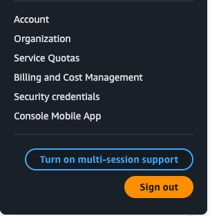
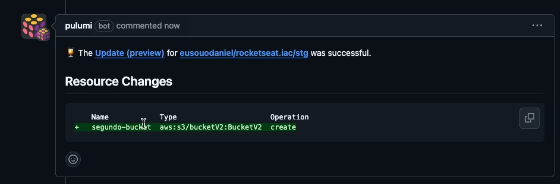
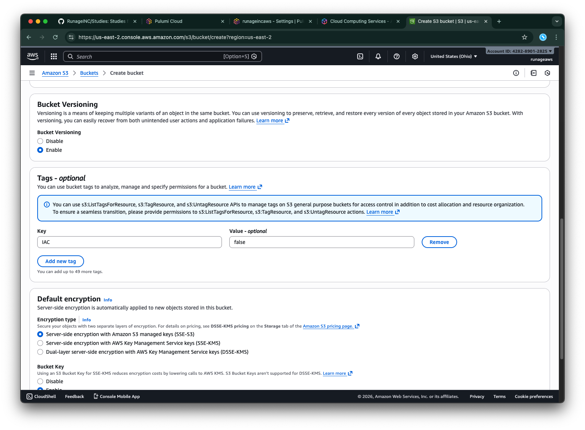

# Intro

Nesse módulo iremos aprender um setup de IaC com Pulumi na AWS. Para iniciar, vamos garantir que o CLI esteja instalado:

`brew install pulumi/tap/pulumi`

Após isso, precisamos das keys da AWS: acesso e secret. Basta entrar na tab de security credentials da AWS para conseguirmos pegar os dados:



Após isso, basta copiar suas keys e setar no seu computador. Depois disso, é necessário criar uma pasta vazia (chamaremos de quickstart), para configurar o projeto em Pulumi. Dentro da pasta, o comando:

`pulumi new aws-typescript`

Dentro da configuração, ao trabalhar com cloud, a boa prática é ter de 2 a 3 ambientes:

1 - Prod (PRD) _
2 - Staging (STG) _
3 - Homologação/Dev (HMG)

Os recursos de Staging não são utilizados em Prod. Com essa secção cada ambiente tem recursos próprios (seguindo o famoso Twelve Factor)

Nessa aplicação, utilizei a default de Virginia para a AWS (us-east-1), NPM e de ambiente STG.

Após isso, é criado um projeto novo em TypeScript com as configurações iniciais do Pulumi.

## Boilerplate

Dentro da estrutura do Pulumi, temos alguns arquivos importantes:

1. Pulumi.yaml

Como se fosse o package.json de projetos pulumi, com descrição, nome do projeto e options para subir. Tem também o package manager, tags, etc.

2. Pulumi.stg.yaml

Configuração específica para o ambiente de staging. Para outros ambientes, basta ter outros yamls similares. É possível inclusive mudar a região de apontamento

3. index.ts

Arquivo principal do Pulumi, cria os recursos e associa na cadeia de dependências do código.

Basicamente com esse código:

```typescript
import * as aws from "@pulumi/aws";

// Create an AWS resource (S3 Bucket)
const bucket = new aws.s3.Bucket("first-test");

// Export the name of the bucket
export const bucketId = bucket.id;
export const bucketArn = bucket.arn;
export const bucketName = bucket.bucket;
```

Podemos rodar o comando `pulumi up` e esperar a criação da infra. Todo comando vai gerar um output e também vai pedir para aceitar as atualizações feitas. É possível rodar o up com a flag `-y`, para aceitar automaticamente os updates.

O comando `pulumi destroy` também pode destruir a infra criada. Também aceita o `-y`.

A criação do bucket consegue comportar argumentos, que são bem úteis para garantir algumas coisas como nome e tags:

```typescript
const bucket = new aws.s3.Bucket("first-test", {
  bucket: "first-test-bucket",
  tags: {
    IAC: "true",
  },
});
```

A tag de IAC true garante que o gerenciamento aconteça somente por IAC, sendo qualquer outra alteração sendo perdida no futuro. Já a flag bucket vai trazer o nome da tag

## Criando outros recursos

Para criar outros recursos, basta adicionar novas linhas conforme o recurso desejado.

Ex: um novo recurso de ECR

```typescript
// Novo recurso

const ecr = new aws.ecr.Repository("first-test-ecr", {
  name: "first-test-ecr",
  imageTagMutability: "IMMUTABLE",
  tags: {
    IAC: "true",
  },
});

export const ecrName = ecr.name;
export const ecrRepositoryUrl = ecr.repositoryUrl;
```

Vale lembrar que os nomes dentro da property de `name` de cada recurso é único, portanto dois recursos com o mesmo nome não podem existir.

É possível automatizar para utilizar o github actions. A pasta do pulumi também pode estar dentro da app caso seja um grande monorepo.

## Pipeline

A cada commit no nosso repositório, o pulumi irá fazer uma alteração na infra.

Podemos setar nosso próprio workflow com um yml, que estará em `.github/workflows/main.yml`

Vale ressaltar que as secrets são necessárias pra esses steps no github, e além disso é necessário criar um token de login para o Actions acessar o Pulumi sem o CLI interativo

Os comandos de up dentro do github tem auto approve. Dentro do SCM isso é ruim portanto é necessário uma pipe para cada abertura de PR e uma só na main, para termos um preview do impacto de cada PR de abertura para modificar a estrutura do Pulumi.

Para isso, há um novo yml chamado `pr.yml` que vai controlar os PR's para a main com o preview. Dentro do `branches` desse arquivo, poderíamos criar um pra releases ou pra qualquer outro controle que tivermos, mas por hora vamos deixar somente na main

Os comandos da `pr.yml` são similares aos da main, exceto o de Pulumi que ao invés de rodar o up, rodará o preview.

Ao criar a action dessa forma, em uma abertura de PR, podemos ver o bot do pulumi comentar:



Caso não tenha esse comentário basta ir no pulumi e fazer a instalação da extensão de PR Comments.

Caso não queira configurar pelo app, é possível configurar dentro da action também:

```yml
- name: Run pulumi
  id: run-pulumi
  uses: pulumi/actions@v6
  with:
    command: preview
    stack-name: runageincaws-org/stg
    comment-on-pr: true
    github-token: ${{ secrets.GITHUB_TOKEN }}
  env:
    PULUMI_ACCESS_TOKEN: ${{ secrets.PULUMI_ACCESS_TOKEN }}
```

## Destruindo recursos

É possível destruir recursos de algumas maneiras:

- PR para destruir, com uma action específica
- Remoção de código (maneira mais utilizada)

Depois disso, basta fazer um commit que o recurso será destruído. Diferente de rodar o destroy, dessa forma temos o histórico no SCM e também não estaremos destruindo tudo.

## Estado

O Pulumi mantém um contexto do que foi ou não alterado, um estado de cada recurso. É possível ver nos comments como ele cuida disso vendo quem foi alterado e quem não foi.

Para controlar isso, o Pulumi mantém um state file. Para os buckets com tag de IAC, ele sempre vai fazer esse check de estado para entender como estão os componentes, por isso recursos marcados com essa tag ao sofrerem alteração direta na AWS (ou no console usado) não refletem nas PR's do Pulumi nem nos comandos executados. Mas quaisquer alteração no arquivo index causa um update.

Dentro do projeto não existe realmente um arquivo de estado, e ao rodar a pipeline ele também tem acesso a esse arquivo.

Na prática quem está gerenciando o estado é o Pulumi em si, sendo o arquivo de estado salvo na nuvem do pulumi (pego através da credencial de acesso)

Cada stack tem seu proprio state file, e é possível ver o arquivo de estado utilizando o comando `pulumi stack export --file stack.json`

Vale ressaltar que esse comando não comporta qual stack estamos querendo ver, então no caso de múltiplas stacks isso fica complexo. Para contornar isso, basta usar:

- `pulumi stack ls` - lista as stacks disponíveis
- `pulumi stack select <stack>` - seleciona a stack
- `pulumi stack export --file stack.json` - roda e salva dentro do arquivo stack.json.

Esse arquivo é versionado com um array de recursos criados e seus metadados correspondentes.

Caso seja necessário usar outro backend (como azure blob, s3 ou algum outro storage do gcp), o backend precisa ser remoto por conta da pipeline.

## Saindo do Pulumi Cloud para o S3

O primeiro passo é de deletar os recursos e recriar apontando para o S3. Em aplicações onde isso é um problema, outros passos devem ser feitos, mas por hora como não temos nenhuma aplicação rodando é possível rodar dessa maneira mais rápida.

1. `pulumi destroy` - destrói todos os recursos
2. `pulumi stack rm stg` - destrói a stack
3. Criar um bucket na s3 para gerenciar o estado (por exemplo um pulumi-stg), com versionamento

- Importante: O bucket deve ter versionamento e a tag de IAC false: 

4. `pulumi login s3://rocketseat-pulumi-state` - redireciona o login para o bucket
5. `pulumi stack init stg` - para criar uma stack e subir a estrutura
6. Definir uma senha dado que os comandos estão sendo rodados de maneira remota

- O arquivo de Pulumi.stg.yaml também estará diferente, com um encryption salt apenas,

7. `pulumi up` - Se não definir a senha no passo anterior, será definido nessa e os recursos serão criados

Vale ressaltar que dentro do pulumi cloud, não teremos uma informação sobre a stack, dado que quem irá gerenciar vai ser o S3 e não a Cloud.

Após isso, algumas alterações serão necessárias nas pipelines. Os novos arquivos estarão dentro de `s3cloud/`, sendo apenas as credenciais da AWS sendo adicionadas e a cloud-url que vai ser usada apontando para o bucket S3 que contém os arquivos de estado.

Vale lembrar que o Bot também vai deixar de funcionar, deixando de comentar na PR. Para voltarem os comentários é necessário um desenvolvimento para isso.

Caso haja algum erro de deploy, vale conferir o nome da stack.

A env de PULUMI_CONFIG_PASSPHRASE deve ser definida caso haja essa definição nos steps de criação. Caso contrário, não.
