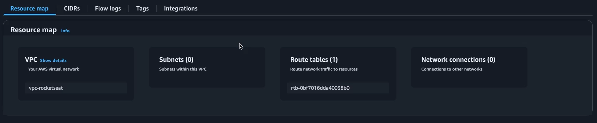
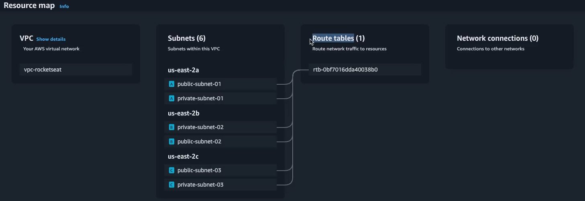
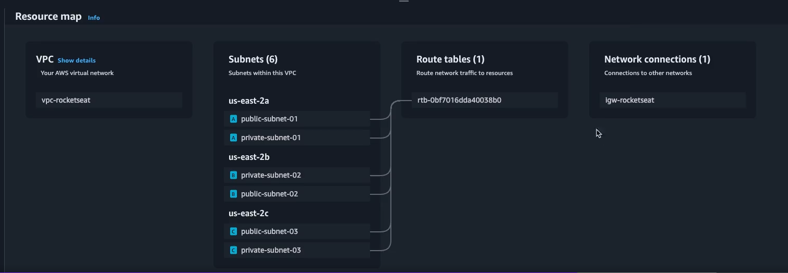
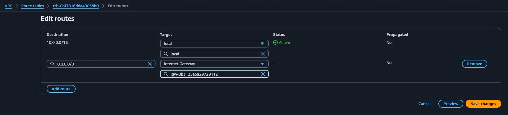
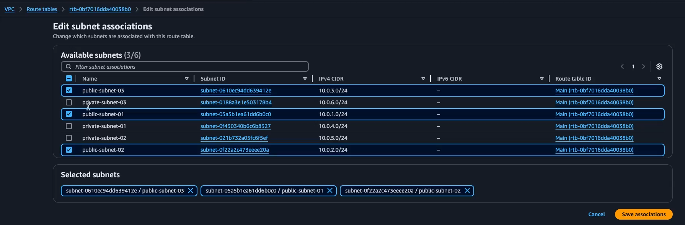
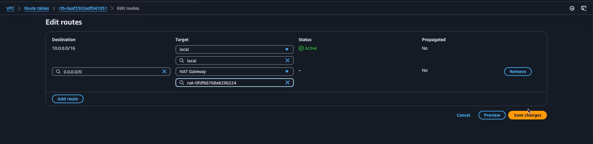
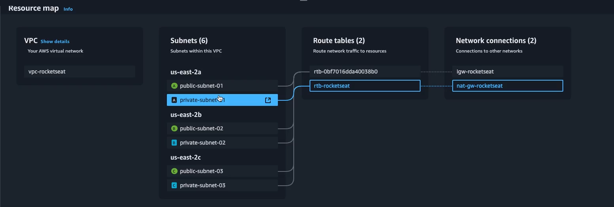
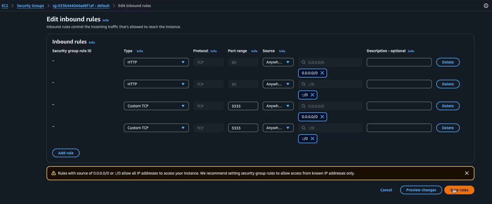
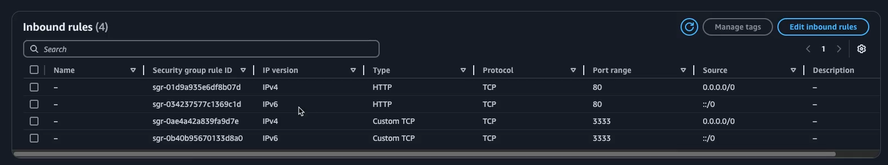

> Todos os recursos devem ser criados com a tag IAC false

# Intro

Diferentemente do App Runner, que podemos acessar de maneira pública, vamos usar o ECS, onde o acesso externo não é tão simples.

Para trabalhar com o ECS, vamos precisar configurar uma VPC para acesso externo, e Subnets para subdividir esses ranges de IP's provenientes da VPC. A VPC por si só é privada, portanto vamos precisar fazer tabelas de roteamento (Route Tables) através de um Internet Gateway para receber tráfegos da internet externa.

Por fim, para organizar a escalabilidade, vamos ter que colocar um Load Balancer.

Dado o cenário de múltiplas réplicas para a aplicação, é necessário ter um load balancer para equilibrar esse tráfego. No caso, a AWS oferece um serviço chamado ALB que utiliza um algorítmo de Round Robin para balancear a carga de requisições entre todas as réplicas.

Além disso, as réplicas estarão embaixo de subnets, seccionadas através da nossa VPC. Essas subnets possuem IP's diferentes para cada réplica e o Load Balancer vai servir como ponto de acesso único para a aplicação independente de qual réplica será chamada.

## Criando um ECS

Seguindo os mesmos passos de todas as outras criações, um ECS é bem simples de se criar.

Para o ECS, podemos ter tanto Fargate quanto EC2. Nesse caso, vamos pela linha do Fargate.

Como boa prática, sempre terá a tag IAC = false

Quando um cluster é criado, podemos ver em Cloud Formation. Essa Cloud Formation é uma stack ferramental que mostra o estado de odos os eventos da AWS, sendo muito usado para os eventos mais complexos como por exemplo criar um ECS.

## Criando Task Definition

Após criado, vamos conhecer a Task Definition. Por padrão, precisamos de uma Task Definition simples pro ECS, com um nome simples. Essa task definition funciona muito similar a um contrato, um blueprint de como o ECS vai rodar o container.

Por hora podemos fazer tudo usando o padrão, com 1 vCPU e 2 GB de ram.

É necessário também uma role de task execution

Uma das coisas interessantes da Task Definition é a possibilidade de usar a Fault Injection, que é uma técnica da engenharia do caos para testar a resiliência dos serviços

Colocaremos o nome do container e a image URI para configurar essa task.

O Mapeamento de portas para o container deve ser especificamente igual ao que temos. No caso: 3333 (porta que roda o widget-server).

Necessário também colocar as env vars necessárias, e deixar o log como default por hora.

Podemos deixar o restante como default até porque a app é efêmera, sem estado.

Caso hajam mudanças de versão ou tag, precisamos criar uma nova revisão. Em teoria a cada novo deploy é necessário uma nova revisão.

## Associando a Task Definition ao Cluster

A Task agora de deploy com o Fargate precisa ser associada com a task defintion criada anteriormente.

Depois disso, temos outras configurações como apontar quantas réplicas teremos (escalabilidade horizontal), qual o deployment option sendo eles:

- Rolling update: vai cadenciar o deploy, fazendo um deploy de nova tag por réplica, por vez, para não derrubar tudo de uma vez e ter downtime.
- Blue/green: roda duas versões ao mesmo tempo mas uma não recebe tráfego, e a virada de tráfego é apontada.

Dentro de configuration também podemos fazer configurações de canary, linear, etc.

Há também uma porcentagem de tasks por deploy. Podemos ter um máximo e mínimo de réplicas por deploy.

Outra funcionalidade legal é o Failure detection, que funciona quase que como um smoke test, fazendo rollback caso detecte algum tipo de erro.

## Criando uma VPC

Chegando na tela de VPCs -> Create VPC, vamos criar uma VPC específica para o projeto.

Nessa VPC, vamos configurar o IPv4 CIDR Block manualmente. A VPC é a rede dentro da AWS. Essa VPC vai ter a capacidade de servir IP's.

Para um auxilio maior, vamos usar o Subnet Calculator: [MX Toolbox - Subnet Calculator](https://mxtoolbox.com/subnetcalculator.aspx)

Na calculadora, vamos usar o IP interno da VPC (10), e os .0.0.0 que são o mascaramento do IP. O número após a barra diz quantos IP's teremos. No caso de /24, teremos quebras em 256 IPs.

Dissecando maior, temos:

Rede: 10.0.0 -> valor imutável
Host: .0 -> valor mutável de 0 a 255

> Vale lembrar que 256 IP's são quase nada. Mais explicações sobre isso dentro do arquivo [Por quê 256 IP's é pouco](./Why256IpsAreNotMuch.md)

Caso estivéssemos trabalhando com /16, teríamos 65.536 IP's, sendo a distribuição:

Rede: 10.0
Host: .0.0

Geralmente, /16 é uma boa prática. Acima disso o gerenciamento fica muito custoso. O CIDR Block trabalha no máximo até /16 somente. A criação deve ser feita com o /16.

Como default, tag IAC = false

Podemos observar que ao criar uma VPC, temos um ResourceMap:

Esse Resource Map nos mostra que o Route Table automaticamente é criado com a VPC, mas as subnets não.

## Criando a Subnet

Mesmo procedimento da VPC, mas a zona de disponibilidade existem algumas coisas:

- As zonas de disponibilidade de um recurso como subnet para a AWS são divididas em algumas letras (a, b, c).
- Cada região possui uma disponibilidade de letras, com distanciamento físico de 100 km entre esses locais.
- Caso algo aconteça a uma dessas zonas de disponibilidade e seu tráfego é definido como Multi AZ (múltiplas zonas de disponibilidade), a zona mais próxima da principal é escolhida para distribuir o tráfego, trabalhando a redundância garantindo a disponibilidade.

Vamos configurar uma para cada disponibilidade, para garantir esse MultiAZ. Uma subnet deverá ser criada por disponibilidade.
Para as Subnets, podemos usar o /24. As três primeiras serão subnets públicas, com o nome public-subnet-01, 02 e 03.

- O primeiro, da zona A, deve conter o endereço 10.0.1.0/24
- O segundo, da zona B, deve conter 10.0.2.0/24
- O terceiro, da zona C, deve conter 10.0.3.0/24

> Mesmo que tentássemos criar 2 subnets com o mesmo endereço, a AWS não iria deixar por conta da colisão.

> Multi AZ e Multiplas Zonas de Disponibilidade são conceitos distintos. Multi AZ seria a distribuição por zonas, como dito anteriormente (a, b, c, etc). Multiplas Zonas seria a distribuição entre diferentes zonas da AWS (us-east-1, us-east-2, eu-east-1, etc)

Agora vamos criar as subnets privadas, da mesma forma porém com os nomes private-subnet-01, 02 e 03:

- O primeiro, da zona A, deve conter o endereço 10.0.4.0/24
- O segundo, da zona B, deve conter 10.0.5.0/24
- O terceiro, da zona C, deve conter 10.0.6.0/24

Por hora, a questão de pública e privada são apenas questões de nomenclatura, mas em breve iremos configurar para realmente ser uma configuração efetiva.

Todas com a tag IAC = false

Agora o Resource Map deve se parecer com:

Mas ainda temos todas as subnets associadas a um Route Table único e isso é um problema. Para resolver, iremos criar uma Internet Gateway e uma NAT Gateway, para acessar a internet. Sem isso, não há tráfego externo.

Depois de criado, vamos fazer um attach à VPC. Caso tudo seja feito certo, esse recurso também aparecerá no mapa:

O problema é que esse recurso ainda está isolado. Vamos agora clicar no Route Table que foi criado automaticamente e vamos editar a rota, adicionando uma nova rota para qualquer de entrada passar pelo Internet Gateway recém criado:

Agora vamos clicar no Route Table, em **Subnet Associations**, e editar esse mapa para que o Route Table enxergue somente as redes públicas:

## Criando um NAT Gateway

Próximo passo é criar um NAT gateway, para previnir TODO E QUALQUER tipo de acesso às nossas redes privadas. Clicando em _nat gateway_ no menu à esquerda, podemos criar um novo do zero. É necessário associar um IP para esse NAT Gateway e por hora vamos associar um Elastic IP.

Infelizmente nossa Route Table não vai servir para nós, portanto precisamos criar uma nova. A grande diferença é que agora precisamos fazer com que esse Route Table passe pelo NAT Gateway e não pelo Internet Gateway:

Agora, essa Route Table vai ter as subnets privadas associadas a ele, e dessa forma estamos garantindo a segurança da app:

Voltando na aba de Network do nosso Cluster ECS, podemos associar agora a VPC recém criada a ele. Além disso, vamos selecionar as 3 subnets públicas para disponibilizar a app:

> Criando somente a VPC e Subnets ele também criaria e atrelaria ao ECS mas não iria funcionar.

Por hora, com essa configuração, ainda só estamos recebendo IP's internos. Agora é necessário o Load Balancer.

## Configurando o Load Balancer

Dentro da configuração do Cluster, vamos selecionar o Load Balancer no modo ALB (Application Load Balancer). Vamos criar um novo Load Balancer, e um só é necessário para várias apps. É possível criar dentro da mesma página. Dentro de Health Check grace period, vamos deixar 10s. Esse campo diz somente de quanto em quanto tempo o HC será executado para garantir a estabilidade da app.

Também é necessário um listener, que é basicamente um watcher que fica escutando em uma porta específica. É possível criar um certificado ou subir uma chave nova, mas por hora não é necessário.

O target group (que também pode ser criado) é quem vai grudar o host no load balancer. Após ir ao listener, o target group vai saber pra quem balancear a carga, dado que ele conhece as 3 réplicas.

Deregistration delay é quanto tempo ele demora pra remover um registro antigo após um novo deploy. 180 é um bom número (3 min), mas o default são 5 minutos.

Health check path precisa existir, e como temos o /heatlh, serve. Ele deve sempre retornar 200.

## Corrigindo as portas no security group

Se tentarmos rodar de primeira, vamos tomar timeout. Basicamente ao criar uma Task, ela está associada a um Security Group, que foi criado pela AWS. Dentro do próprio EC2, podemos editar esse security group que foio criado:

Podemos conferir que funcionou dentro da Inbound Rules:

## Automação do Deploy no novo fluxo

Por hora, teríamos que criar uma nova revisão e alterar a tag na mão para cada novo deploy. Hora de automatizar.
