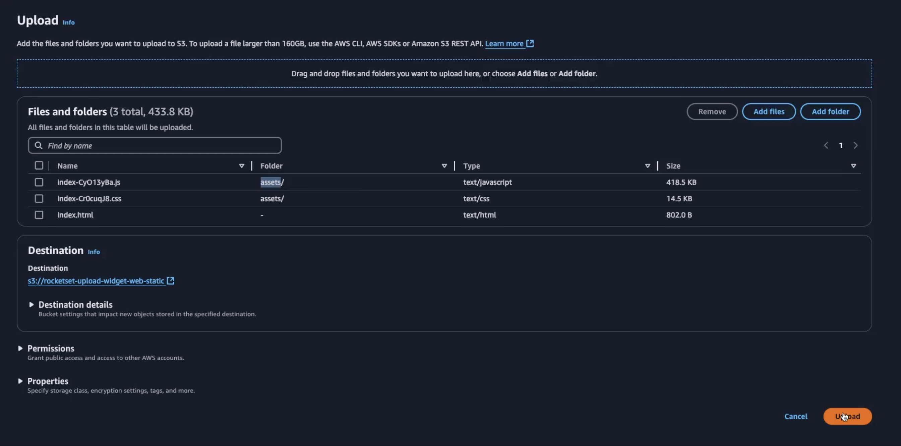

> Tags sempre IAC = false

# Intro

Para o front, apenas o S3 ja serve para hospedagem. O front não precisa da mesma infra que o back, portanto podemos manter ele de forma mais leve.

Inicialmente, faremos no S3. Depois, iremos passar para o S3 + CloudFront (uma CDN), ajudando com relação à Edge Location.

Mais pra frente, também veremos outra maneira de deploy como a Vercel.

Para rodar o projeto, precisamos de:

- Local:
  - pnpm e Run Dev
- Prod:
  - Run Build e rodaremos o asset.

> O projeto da pós foi feito com pnpm, mas o meu foi feito com NPM. Vou adaptar os exemplos e o projeto para pnpm.

## Criando um bucket

A criação do bucket prossegue de maneira normal, como qualquer outro.

Dentro do Object Ownership por hora vamos deixar o Access Control List (ACL) desabilitado. No S3, cada diretório é um objeto. O ACL configura o ownership desse objeto, que no fim é nosso arquivo.

Vamos habilitar o versionamento do bucket. Todo o restante segue como default.

Após criar o bucket, vamos mandar para o bucket de maneira manual mesmo tudo que estiver dentro de dist:



Ele vai gerar uma URL mas ao clicar temos o acesso negado. Isso porque a configuração do acesso público não foi feita. Além disso, esse bucket não foi servido como static website, apenas hospedando o arquivo.

Para mudar isso, basta clicar em **Properties**, e na última parte temos o static website hosting. Basta habilitar, utilizar o bucket como web (Host a static website) e setar o index.html como arquivo principal.

Agora, precisamos mudar o permissionamento do bucket. Dentro de **Permissions**, vamos editar o _Block public access_, desmarcando o checkbox.

Por último, temos que editar a política do bucket:

```json
{
  "Version": "2012-10-17",
  "Statement": [
    {
      "$id": "PublicGetObject",
      "Principal": "*",
      "Effect": "Allow",
      "Action": "s3:GetObject",
      "Resource": ["<arn do bucket>, <arn do bucket>/*"]
    }
  ]
}
```

> Isso pode ser feito navegando através do menu do lado direito, em Edit statement

> Precisamos do arn dado que o /\* vai pegar tudo que vem depois do ARN

Após isso, o site vai funcionar normalmente. Lembrando que todos os arquivos estão públicos. O ideal é manter o bucket somente com a responsabilidade de servir o site e apenas isso, visto que haverá exposição de todos os objetos dentro do bucket.

## Configurando a Pipeline

Todo o arquivo estará dentro do arquivo de workflow que ja conhecemos, em `github/workflows/main.yaml`. Para sincronizar o arquivo com o bucket, vamos utilizar um step de sync para os arquivos:

```yaml
- name: Sync files to S3
  id: sync-files-to-s3
  run: |
    aws s3 sync ${{ env.SOURCE_DIST }} s3://${{ env.AWS_BUCKET_NAME }} --delete --exclude '.*git*'
```
