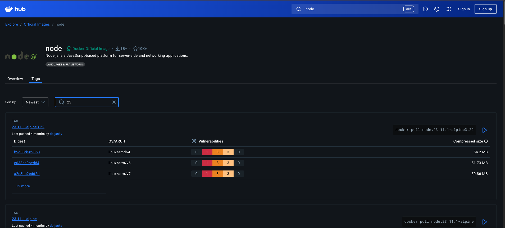

# Docker e Containerização

O projeto utilizado de exemplo foi o projeto de `upload-server-web` que foi criado nas aulas anteriores.

Esse projeto de dockerização vai mostrar alguns passos de como configurar corretamente um container, levando em conta todas as peculiaridades de cada app. Como a proposta do curso mostra diversas formas de build como build de execução e multistage, eu separei em folders de build cada Dockerfile com as melhorias necessárias.

## Primeiros passos

Ao criar uma imagem de container com o intuito de rodar a aplicação, é importante saber o que a app precisa pra rodar. Qual será o passo a passo de construção da execução, dado que no fim a imagem é apenas uma instrução de como rodar a app.

Para isso, o primeiro ponto é analisar a aplicação em si. O primeiro ponto é que essa app de estudo é uma app em Node, que utiliza TypeScript e AWS. Além disso, o projeto também possui um arquivo de envs para trabalhar.

O projeto do curso utiliza o pnpm mas o construído utiliza o npm puro. Nesse readme, vou deixar os dois cenários: npm e pnpm.

Quando uma app utiliza o node, ou qualquer outra linguagem de programação com runtime, é necessário um comando para instalar as dependências. Nesse caso, temos os seguintes comandos, em ordem:

### npm

- npm install
- npm build
- adição das env vars
- node file.js ou npm run dev

### pnpm

- pnpm install
- pnpm build
- adição das env vars
- node file.js ou pnpm start

Dentro do arquivo de package, temos o script de dev. Esse arquivo possui os comandos que podem ser rodados, no caso por exemplo o comando de dev.

Dado toda essa inspeção, podemos criar nosso `Dockerfile`. Esse arquivo vai carregar as instruções para carregar o container.

Via de regra, cada app possui seu próprio Dockerfile, dado que a responsabilidade do container é de execução de sua própria app, declarativamente. Por motivos de estudos, o Dockerfile ficará dentro da pasta principal e não da pasta do projeto, mas o ideal é que hierarquicamente esse arquivo esteja dentro do projeto.

O melhor lugar para se procurar uma imagem para um tipo de tecnologia é o [Dcoker Hub](https://hub.docker.com)

O nome dessa imagem é _base image_, que é a imagem de base para rodar essa aplicação. A base image pode ser encontrada dentro de tags de uma imagem:



Geralmente imagens **alpine** são imagens mais leves:

```Dockerfile
FROM node:23-alpine

RUN npm run dev
```

Para base images privados, é necessário lidar com autenticação.

## Buildando a imagem

Para executar essa imagem, é necessário usar o comando `docker build -t <nome da imagem>:<tag> <localização da imagem>`.

`docker build -t widget-server:v1 .`

No nosso caso, o projeto está dentro do mesmo diretório, portanto o -f acaba ficando com o ponto para indicar mesmo repositório ou nada, dado que o Dockerfile funciona como uma espécie de index.

Vale ressaltar que rodando somente um install após o node não vai funcionar dado que não deixamos nenhum arquivo declarativo como o `package.json` dentro:

```Dockerfile
COPY package.json package-lock.json ./
```

Esse `./` é o folder de trabalho, mas isso não é uma boa prática. O ideal é termos uma estrutura dentro do container para trabalhar com a aplicação, para que o conteúdo da app não se misture com o do container. Essa estrutura de trabalho é definido através da keyword `WORKDIR`:

```Dockerfile
FROM node:23-alpine

WORKDIR /usr/src/app

COPY ./upload-server-web/package.json ./upload-server-web/package-lock.json ./

COPY ./upload-server-web ./upload-server-web

RUN npm install
```

Também estamos copiando, através do `COPY ./upload-server-web ./upload-server-web` os arquivos da aplicação pra rodar no container. E por fim, vamos expor essa porta através do `EXPOSE 3333`, e depois vamos rodar o nosso comando de `CMD` para executar a app:

```Dockerfile
EXPOSE 3333

CMD ["npm", "run", "dev"]
```

> Em casos de projetos com pnpm, é necessário instalar o comando também. Existem poucas diferenças, sendo elas apenas a instalação global do pnpm e a execução dos scripts.

```Dockerfile
FROM node:23-alpine

RUN npm i -g pnpm

WORKDIR /usr/src/app

COPY ./upload-server-web/package.json ./upload-server-web/pnpm-lock.yaml ./

COPY ./upload-server-web ./upload-server-web

RUN pnpm install

EXPOSE 3333

CMD ["pnpm", "dev"]
```

Vale lembrar que estamos usando o `alpine` como imagem base dado sua leveza, já que é uma distro linux super enxuta tendo uma menor superfície de ataque. Isso porque cada execução de um container faz com que a imagem seja baixada para a máquina que o está executando e portanto quanto mais leve, melhor e menos vulnerável a ataques.

Vale lembrar que temos um `.dockerignore` para excluir arquivos dessa cópia.

## Rodando a imagem

Depois de buildar, temos que rodar dizendo qual a porta que vamos utilizar na máquina local e qual porta vamos utilizar dos binários gerados no container. Dado a nossa configuração de 3333, vamos utilizar localmente a 3000 pra rodar, apenas para mostrar as diferenças no comando em si:

`docker run -p 3000:3333 -d upload-server-web:v1`

> A flag -d é para rodar em modo dettach, ou seja sem bloquear o console.

Rodando em modo dettach, para ver os logs basta executar `docker logs <imageId>` e para parar a execução de uma imagem dettached basta rodar `docker stop <imageId>` assim como o `docker start <imageId>`. Os id's podem ser capturados através do comando `docker ps` ou `docker ps -a`. O primeiro lista as imagens que estão rodando enquanto que a segunda lista todas as imagens. que já foram executadas independente de estarem ativas ou não.

Ainda assim existem alguns problemas dentro da imagem. O primeiro deles é a execução do comando no modo dev, sendo que isso não é uma boa prática. Outro problema é que nosso `COPY` copia literalmente tudo para o container, especialmente os `.env`s. A app inclusive só funcionou por conta dessa cópia.

## Melhorando a imagem

Para melhorar a imagem, vamos criar (se já não existe) um comando de `build` e outro de `start`:

#### package.json

```json
"build": "tsup-node",
"start": "node dist/infra/http/server.js"
```

Agora vamos alterar dentro do Dockerfile todos os comandos necessários após o install:

```Dockerfile
RUN npm install
RUN npm build
RUN npm prune --prod

EXPOSE 3333

CMD ["npm", "run", "start"]
```

> Na aula, os passos são um pouco diferentes. Dado que existe uma diferença dos projetos de back-end e da arquitetura do pnpm, o package.json teve os seguintes comandos:

#### package.json

```json
"build": "tsup src --format esm",
"start": "node dist/server.mjs"
```

```Dockerfile
RUN pnpm install

COPY . .

RUN pnpm build
RUN pnpm prune --prod

EXPOSE 3333

CMD ["pnpm", "start"]
```

Um comando importante da imagem foi o `prune --prod`. Isso remove todas as dependências de desenvolvimento do node_modules na hora da construção da imagem, deixando somente o necessário para produção.

Antes de executar, é necessário declarar as variáveis. Existem uma série de maneiras de inferir uma variável, sendo uma delas o comando `ENV`:

```Dockerfile
ENV PORT=<valor>
ENV NODE_ENV=<valor>

# Database
ENV DATABASE_URL=<valor>

# Cloudflare
ENV CLOUDFLARE_ACCOUNT_ID=<valor>
ENV CLOUDFLARE_TOKEN_VALUE=<valor>
ENV CLOUDFLARE_BUCKET=<valor>
ENV CLOUDFLARE_PUBLIC_URL=<valor>

# S3
ENV AWS_ACCESS_KEY_ID=<valor>
ENV AWS_ACCESS_KEY_SECRET=<valor>

ENV SPECIFIC_ENDPOINT=<valor>
```

> Dentro do curso, de início foi utilizado já uma grande imagem do node, aumentando a superfície de ataque e dos binários para rodar a aplicação, chegando a 1,2GB. No caso da construção do projeto, já de início utilizei o alpine para evitar esse problema. De toda forma, o uso de alpine é ensinado posteriormente.

## Multistage build

O alpine é uma imagem de execução é diferente de uma imagem de construção. No ato de execução, podemos utilizar essa imagem sem problemas levando em conta seu peso, porém no ato de construção não é bem assim. O nome disso é `multistage build`. Isso significa que dentro do dockerfile, teremos vários `FROM`s, podendo ir de uma imagem maior para uma menor em cada um de seus campos (construçõa ou execução).

Primeira coisa a ser feita é utilizar uma imagem maior para a instalação de recursos globais:

```Dockerfile
FROM node:23 AS base

RUN npm i -g pnpm

FROM base AS dependencies

WORKDIR /usr/src/app

COPY package.json pnpm-lock.yaml ./

RUN pnpm install

FROM base AS build

WORKDIR /usr/src/app

COPY . .
COPY --from=dependencies /usr/src/app/node_modules ./node_modules

RUN pnpm build
RUN pnpm prune --prod
```

No primeiro comando, temos a instalação do Node 23 de uma imagem maior como base, e seguido disso, uma instalação das dependências a partir da base. Para cada estágio do container, ou seja cada `FROM`, precisamos declarar caso necessário o `WORKDIR` novamente.

Após as cópias e execuções de build, podemos cuidar de reduzir o tamanho da imagem para execução do projeto:

```Dockerfile
# ...comandos anteriores
FROM node:23.11.1-alpine3.22 AS runner

WORKDIR /usr/src/app

COPY --from=build /usr/src/app/dist ./dist
COPY --from=build /usr/src/app/node-modules ./node-modules
COPY --from=build /usr/src/app/package.json ./package.json

# ENVs
EXPOSE 3333

CMD ["node", "dist/server.mjs"] # A imagem alpine não tem pnpm, portanto podemos rodar diretamente com o node
```

Ainda poderia haver uma imagem menor com distros, e quanto menor a imagem, melhor.

## Caching e Camadas

As camadas fazem parte do sistema de armazenamento do docker, fazendo com que ele seja mais flexível. No caso, os containers sempre partem de uma imagem base, como vimos, e podemos reaproveitar as imagens e comandos entre containers em comum

Vale lembrar que o container é efêmero, ou seja caso deletado tudo se perde (a menos que seja usado o conceito de volumes, que será visto mais pra frente).

Essas camadas ajudam a ter eficiência e reaproveitamento na hora de construir uma imagem. Muito útil de se utilizar o `docker history` nessa hora, para detectar padrões.

Cada camada é imutável, portanto se há uma alteração numa camada de hierarquia superior, todas as camadas abaixo são alteradas. Isso porque, pela característica da imutabilidade a camada é substituída. Caso não haja alteração alguma temos apenas as mesmas camadas trabalhadas de maneira cacheada pelo próprio docker para reduzir o tempo de build

> Uma alternativa ao CMD é o ENTRYPOINT. A diferença é que o ENTRYPOINT é estático enquanto que o CMD pode-se utilizar inferências aos comandos. É comum trabalhar também com os dois:

```Dockerfile
CMD ["node", "dist/server.mjs"]
ENTRYPOINT ["node", "dist/server.mjs"] # Mesmo efeito do CMD
```

## Segurança e Scanning

Caso seja necessário acessar a interface do container, é possível. O comando `docker exec -it <id do container ou nome dele> bash` permite com que tenhamos um console interativo

> Dentro do comando do build pode-se passar a flag --name para definir um nome e não deixar o docker gerar um aleatório para ele.

Caso seja uma imagem alpine, o comando com bash não irá funcionar, dado que a imagem de base não possui esse recurso. Para esse tipo de imagem, basta substituir para /bin/sh

Executando um `whoami` podemos perceber que estamos como root dentro do container. Isso é um furo de segurança dado que não é necessário esse nível de permissionamento para rodar uma aplicação. As permissões devem ser feitas sob demanda, e nesse caso o ideal é trabalhar com o conteito de rootless (sem root).

No build de uma aplicação, geralmente é criado um usuário com ID (por exemplo o user 1000).

```Dockerfile
USER 1000 # ou qualquer outro ID de user
```

Os containers podem também possuir vulnerabilidades. Por via de regra, cada vulnerabilidade terá uma severidade para classificação (critical, high, medium, low). Cada vulnerabilidade possui algumas informações como o pacote, tipo, autor, licença e localização do problema.

Podemos ter vulnerabilidades na imagem ou na app. Na imagem sempre é no processo de construção de camadas enquanto que na aplicação é no processo de desenvolvimento e utilização dos pacotes necessários para rodar a lógica do software. Ferramentas de análise sintática como **SonarQube** já possuem um security hotspot para verificar as vulnerabilidades em tempo de execução. Cada vulnerabilidade é chamada também de CVE (Common Vulnerability Exposure) e possui um código rastreável no banco para ver qual o problema real da vulnerabilidade.

Pode-se configurar localmente e via CI (que será usado mais pra frente).

A ferramenta utilizada foi a **trivy**, uma ferramenta open source que visa encontrar vulnerabilidades e misconfigurations na estrutura do projeto e dos containers. Localmente basta rodar o comando:

`trivy image <imagem requerida>`

Essa ferramenta baixa um banco de vulnerabilidades já detectadas e faz um scan completo da imagem e também mostra qual versão foi feito o fix caso haja.

O banco online mais comum é o https://www.cve.org/.

## Distroless

Ajuda a ter um container com responsabilidade específica. Apesar de o sentido literal ser sem distribuição, não é bem assim que acontece. O distroless basicamente é uma versão de uma imagem totalmente preparada para executar de acordo com a tecnologia a ser trabalhada.

Existem 2 maneiras de se trabalhar com isso:

### 1

- https://github.com/GoogleContainerTools/distroless -> Possui imagens mantidas pelo google. Caso seja utilizado, é necessário passar o endereço completo para que o registry seja encontrado (dado que o default é o Docker Hub)

```Dockerfile
FROM gcr.io/distroless/nodejs22-debian12 as runner

CMD ["dist/server.mjs"] # Não precisa do comando node aqui já que ele já está na imagem base
```

A nível de camada e de segurança o ganho é muito mais expressivo do que se compararmos somente o tamanho de uma imagem com o alpine. Esse tipo de imagem não possui nem shell nem bash portanto é impossível de executar o it. É uma imagem literalmente voltada para executar a aplicação, tendo uma superfície menor de ataque.

### 2

- https://images.chainguard.dev/ -> Imagens mantidas pela Chainguard. Não é gratuíto diferente da do Google, mas ajuda bastante. O principal foco é eliminar as CVE's sendo a mais segura de todas.

```Dockerfile
FROM cgr.dev/chainguard/node:latest as deploy # Latest é o único free apesar de não ser uma boa prática.
```

Possui a mesma ideia do Google Container Tools, sem necessidade de passar o node. Mas diferente do google, ele faz um single layer de camada com um tamanho X, mas também garante a ausência de exposição

As imagens dev possuem um tamanho maior do que as imagens de prod. Isso porque elas foram pensadas para serem utilizadas no campo de build e não no campo de execução.
