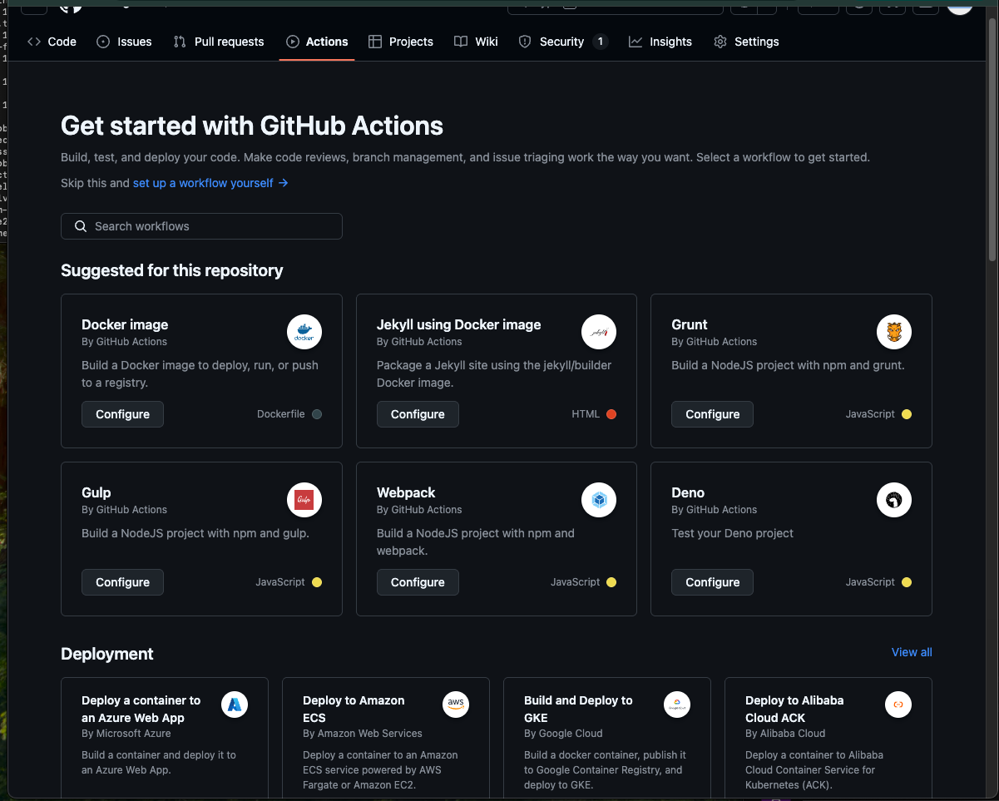
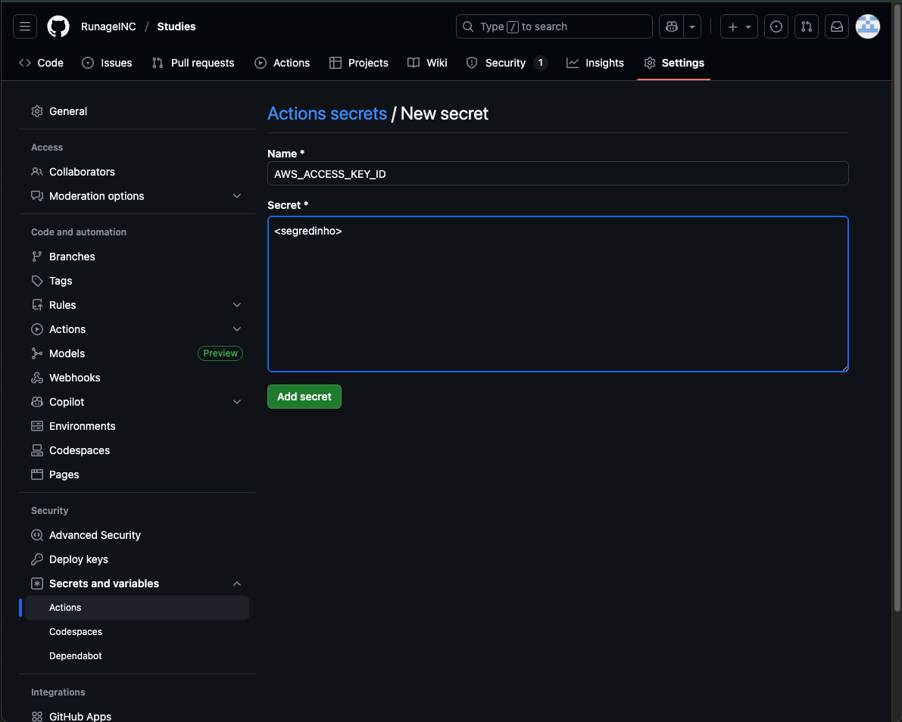
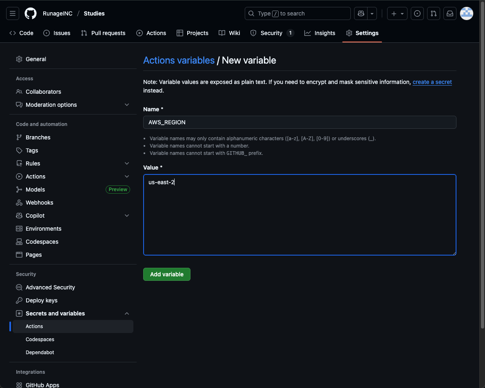

# CI e CD

Quando precisamos deployar/publicar/disponibilizar a app, não conseguimos ganhar agilidade sem CI/CD. Se o fluxo não for automatizado, existe uma oneração tremenda do time.

CI e CD são passos sequenciais que dependem de integração para garantir as entregas da aplicação de forma contínua e ágil.

- CI: Continuous Integration - Integração Contínua
  - lint
  - testing (unit | integration | e2e | smoke | stress)
  - algum scan de vulnerabilidade
  - scan de código (sonarqube, etc)
  - build
  - build da imagem de container
  - push da imagem no registry
- CD: Continuous Delivery - Entrega Contínua
  - Pull da imagem
  - Run

A ideia é de que esse fluxo inteiro aconteça a cada commit na main, ou seja a cada PR aberto para mergear com a main, ou branch dev, ou branch produtiva, dependendo da estratégia, podendo ser um gitflow ou qualquer outra coisa.

Os steps não são todos obrigatórios podendo ter mais ou menos steps. O mais comum de se utilizar para CI é o Github Actions.

O Github Actions executa um job que carrega e executa cada um dos steps

## Utilizando o Github Actions

Podemos criar via CLI ou interface mas o importante é ter um repo para trabalhar. Após isso na aba de github actions:



Podemos clicar em _setup a workflow yourself_ e começarmos a criar nosso flow. Esse arquivo é criado dentro de .github/workflows e é um arquivo do tipo `yaml`. É possível criar localmente da mesma forma o github workflow (que farei nesse caso dado que tenho muitas pastas)

Podemos ter vários workflows, não necessariamente somente um. Usarei o arquivo de nome main para isso.

```yaml
name: widget-server pipe

on:
  push:
    branches:
      - main

jobs:
  build:
    name: Build
    runs-on: ubuntu-latest

    steps:
      - name: Checkout
        uses: actions/checkout@v4
```

Descrevendo cada comando:

- Os comandos **on > push > branches** determina em quais momentos esse comando irá rodar. No caso, será na main.
- **jobs > build > name** e **runs-on** determina qual o nome do processo e em cima de qual tipo de máquina ele vai ser utilizado
  - **steps > name: Checkout** e **uses: actions/checkout@v4** - nome do step. Apenas uma identificação do que a etapa faz. O uses faz com que já estamos utilizando um comando que já existe.

Agora que temos a base, queremos incrementar para enviar a imagem para o registry ECR e utilizar as credenciais. Para que essa execução seja possível é necessário fazer algumas inferências e configurações de secrets no próprio github. Para isso, basta adicionar mais um step após o checkout:

```yaml
- name: Configure AWS credentials
  id: configure-aws-credentials
  uses: aws-actions/configure-aws-credentials@v4
  with:
    aws-access-key-id: ${{ secrets.AWS_ACCESS_KEY_ID }}
    aws-secret-access-key: ${{ secrets.AWS_SECRET_ACCESS_KEY }}
    aws-region: ${{ vars.AWS_REGION }}
```

Dentro de **Security** no Github, podemos criar Secrets e Variables > Actions e New Repository Secret para rodar o comando, com os nomes correspondentes: AWS_ACCESS_KEY_ID e AWS_SECRET_ACCESS_KEY e uma variável com o nome de AWS_REGION para praticar:




Após isso, vamos utilizar o serviço de login do actions:

```yaml
- name: Login to AWS ECR
  id: login-ecr
  uses: aws-actions/amazon-ecr-login@v2
```

O id nos steps serve para identificar o step caso precisemos utilizar o output. Por fim, hora de adicionar o step de push

```yaml
- name: Generate image tag
  id: generate-image-tag
  run: |
    SHA=$(echo $GITHUB_SHA | head -c7)
    echo "sha=$SHA" >> $GITHUB_OUTPUT

- name: Build and push image to AWS ECR
  id: build-push-image
  env:
    ECR_REGISTRY: ${{ steps.login-ecr.outputs.registry-id }}.dkr.ecr.${{ vars.AWS_REGION }}.amazonaws.com
    ECR_REPOSITORY: ${{ vars.ECR_REPOSITORY }}
    IMAGE_TAG: ${{ steps.generate-image-tag.outputs.sha }}
  run: |
    docker build -t $ECR_REGISTRY/$ECR_REPOSITORY:$IMAGE_TAG .
    docker push $ECR_REGISTRY/$ECR_REPOSITORY:$IMAGE_TAG
```

Existem alguns passos acontecendo nesses steps.

- Primeiro, estamos gerando uma image tag com base no SHA do github, que é o hash do commit. Isso porque esse commit não é gerado 2x com o mesmo valor de hash, sendo um valor único e totalmente aceitável de se utilizar como tag version number.
- Estamos armazenando esse valor dentro de uma variável `sha` com apenas os primeiros 7 caractéres e utilizando a sintaxe do github ($GITHUB_OUTPUT) estamos jogando o valor para ser acessado pello próximo step.
- Em seguida, estamos utilizando dessa variável, juntamente com a combinação de envs de repositório com envs de step para gerar de forma dinâmica tanto o registry quanto o repositório e a tag da image.
- Por fim, fazemos a execução do build e push para nosso ECR.

Esses steps evitam valores hardcoded de registry, region, tag, todo tipo de valor que pode vir a ser dinâmico e acaba se tornando uma má prática.

> É possível também definir envs dentro do arquivo de workflow como um todo mas o ideal é utilizar as vars do git. Porém serve de curiosidade:

```yaml
name: widget-server pipe

on:
  push:
    branches:
      - "main"
env:
  AWS_REGION: us-east-2
  CONTAINER_REPOSITORY: container1
```

## Enviando para o Docker Hub

É possível também no momento de build enviar a imagem para o Dcoker Hub. No exemplo anterior, enviamos para o ECR e nesse de agora iremos enviar diretamente para o Hub. Para isso, o código ficará concentrado em um outro arquivo para que não exista sobrecarga de responsabilidades. O novo arquivo será `github-actions-dockerhub.yml` fora dos workflows para não executar passos desnecessários, mas manteremos ele de exemplo.

O arquivo é muito similar ao da AWS, apenas trocando o que é necessário do ECR para o DockerHub. Devemos lembrar de que precisamos também criar um token para acessar o docker hub, no lugar do password.

> Um atalho grande é o marketplace do github actions.

## Action de Build

Se quisermos, existe uma action para abstrair a etapa de push and build.

> Ver sobre multi-platform image
> Ver sobre push-multi-registries - não é muito comum mas se fizer sentido...

Com essa actions, os envs não funcionam bem com o comando de env do yaml. Para essa forma, temos que passar a variável de maneira direta.

## Action de Node e PNPM

Esses steps extras vão cuidar de configurar o node e o pnpm:

```yml
- name: Configure node
  id: configure-node
  uses: actions/setup-node@v4
  with:
    node-version: 20

- name: Configure pnpm
  id: configure-pnpm
  uses: pnpm/action-setup@v4
  with:
    version: 8

- name: Install dependencies
  id: install-dependencies
  run: |
    pnpm install --frozen-lockfile
```

Esses steps executarão a instalação do pnpm e configuração do node. Por fim, podemos instalar as dependências e executar o frozen-lockfile para manter os steps.

## Adicionando o Trivy

Falta adicionar agora o scan de vulnerabilidades e inclusive podemos bloquear a pipe caso encontremos alguma vulnerabilidade.

```yml
- name: Run Trivy vulnerability scan
  id: trivy-vulnerability-scan
  uses: aquasecurity/trivy-action@0.29.0
  with:
    image-ref: ${{ steps.login-ecr.outputs.registry }}/${{ vars.ECR_REPOSITORY }}:scan
    format: "table"
    scan-type: "image"
    ignore-unfixed: true
    vuln-type: "os,library"
    severity: "CRITICAL,HIGH,MEDIUM,LOW"
    exit-code: "1"
```

Dentro desse comando, temos algumas opções importantes:

- **ignore-unfixed: true**: Ignoramos as vulnerabilidades que não possuem um fix pronto.
- **vuln-type: "os, library"**: Queremos capturar vulnerabilidades do tipo OS e Lib
- **severity: "CRITICAL,HIGH,MEDIUM,LOW"**: Capturamos todos os níveis de vulnerabilidade
- **format: "table"**: formato de tabela para o reporte

Esse step tem de estar antes do step de envio da imagem ao ECR, ou seja, antes do build e push. Para isso, podemos fazer uma inferência dentro do build and push step e exportar esse resultado.

A referência de imagem será gerada em um segundo step de build, feito somente para o scan mas sem o push:

```yml
- name: Build and export image to scan
  id: build-push-image-scan
  uses: docker/build-push-action@v5
  with:
    context: .
    load: true
    tags: |
      ${{ steps.login-ecr.outputs.registry }}/${{ vars.ECR_REPOSITORY }}:scan

- name: Run Trivy vulnerability scan
  id: trivy-vulnerability-scan
  uses: aquasecurity/trivy-action@0.29.0
  with:
    image-ref: ${{ steps.login-ecr.outputs.registry }}/${{ vars.ECR_REPOSITORY }}:scan
    format: "table"
    scan-type: "image"
    ignore-unfixed: true
    vuln-type: "os,library"
    severity: "CRITICAL,HIGH,MEDIUM,LOW"
    exit-code: "1"
```

Nesse approach, vale ressaltr, que o build acontece 2x. Podemos considerar executar o build em um outro step pra aproveitar, caso necessário.

## Cache na Pipeline

Documentação de referência: [Build and Push Images - Github Actions](https://github.com/marketplace/actions/build-and-push-docker-images)

O gerenciamento de cache possui várias opções. Dentro do próprio actions existe o cache. Esse em específico armazena o cache para os workflows e será o que será usado nesse setup.

Existe um step de setup:

```yml
- name: Setup Docker Buildx (cache)
  id: setup-docker-buildx
  uses: docker/setup-buildx-action@v3
```

E depois podemos na parte de export dizer de onde esse cache virá (caso exista) e para onde vai:

```yml
- name: Build and export image to scan
  id: build-push-image-scan
  ...
  with:
    ...
    cache-from: type=gha
    cache-to: type=gha,mode=max
    ...

- name: Build and push image to AWS ECR
  id: build-push-image
  uses: docker/build-push-action@v5
  with:
    ...
    cache-from: type=gha
    ...
```

Detalhe que na etapa de build não estamos fazendo um cache-to. Isso porque não faz muito sentido dado que estaremos apenas utilizando um cache de uma build pré gerada, antes da verificação de vulnerabilidades. O próprio step de cache também necessita de um tempo, portanto fazer essa pequena otimização é bem importante.

Outras estratégias de cache podem ser mais performáticas do que a do github actions. A do github actions ainda é experimental.
